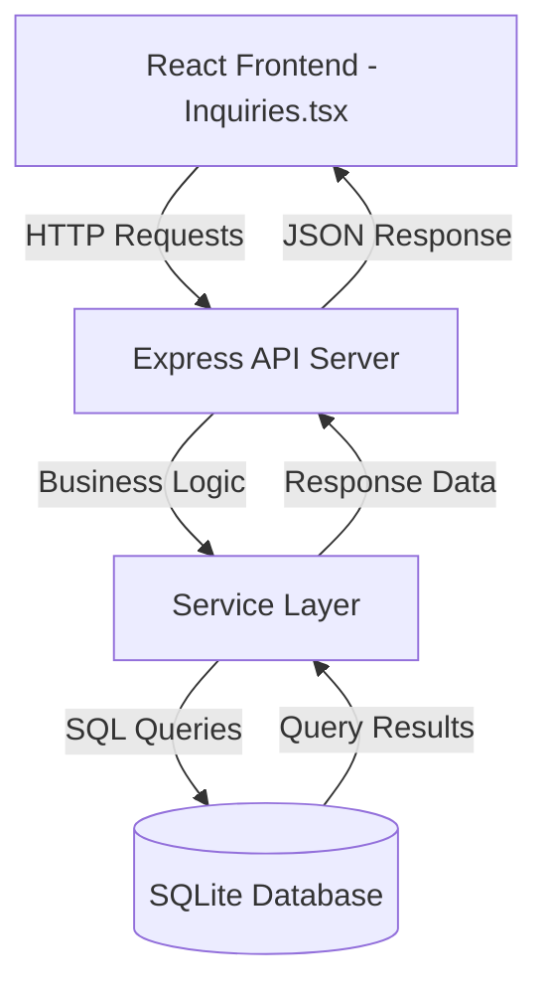
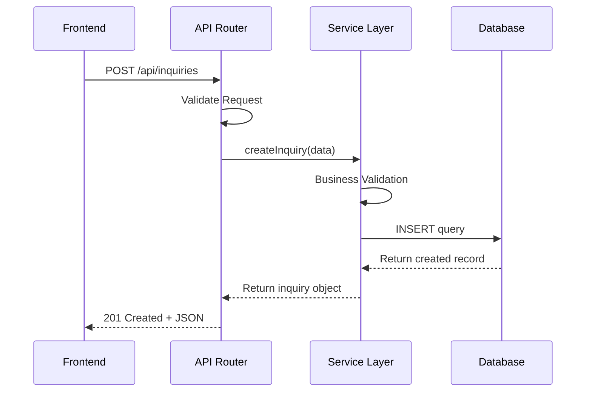

# Backend Implementation for Sales Inquiry Page

## Overview

This design outlines the complete backend implementation for the sales inquiry page, replacing the current localStorage-based mock data system with a proper backend server using SQLite database. The backend will provide RESTful API endpoints to support full CRUD operations for inquiries, customers, and products.

## Strategic Goals

1. Replace localStorage persistence with a proper SQLite database
2. Implement a Node.js Express server to handle API requests
3. Maintain compatibility with existing frontend React components
4. Ensure data integrity and validation at the backend layer
5. Enable future scalability to more robust database systems

## Architecture Overview

### System Components

The backend architecture consists of three primary layers:

1. **API Layer**: Express.js REST API server handling HTTP requests
2. **Business Logic Layer**: Service layer containing inquiry, customer, and product operations
3. **Data Access Layer**: SQLite database with proper schema and query handling



### Data Flow



## Database Design

### Schema Structure

The database will contain four primary tables: inquiries, customers, products, and a junction table for inquiry-product relationships if needed.

#### Customers Table

| Column Name | Data Type | Constraints | Description |
|-------------|-----------|-------------|-------------|
| id | TEXT | PRIMARY KEY | Unique identifier (UUID) |
| customer_name | TEXT | NOT NULL | Customer name |
| since | TEXT | NULL | Customer relationship start date (ISO 8601) |
| address | TEXT | NULL | Primary business address |
| delivery_address | TEXT | NULL | Delivery address (can differ from business address) |
| area | TEXT | NULL | Geographic area or region |
| tin | TEXT | NULL | Tax Identification Number (TIN No.) |
| team | TEXT | NULL | Assigned team name |
| salesman | TEXT | NULL | Assigned salesperson name or ID |
| province | TEXT | NULL | Province location |
| city | TEXT | NULL | City location |
| refer_by | TEXT | NULL | Referral source |
| price_group | TEXT | NULL | Customer price group classification |
| business_line | TEXT | NULL | Type of business or industry |
| terms | TEXT | NULL | Payment terms |
| transaction_type | TEXT | NULL | Type of transactions allowed |
| vat_type | TEXT | NULL | VAT classification type |
| vat_percentage | REAL | NULL, CHECK >= 0 AND <= 100 | VAT percentage applicable |
| dealership_terms | TEXT | NULL | Dealership agreement terms |
| dealership_since | TEXT | NULL | Dealership start date (ISO 8601) |
| dealership_quota | REAL | NULL, CHECK >= 0 | Dealership quota amount |
| credit_limit | REAL | NULL, CHECK >= 0 | Maximum credit limit allowed |
| status | TEXT | NOT NULL | Customer status (active, inactive, suspended, etc.) |
| comment | TEXT | NULL | Additional notes or comments |
| debt_type | TEXT | NULL | Type of debt arrangement |
| created_at | TEXT | NOT NULL | ISO 8601 timestamp |
| updated_at | TEXT | NOT NULL | ISO 8601 timestamp |

#### Contact Persons Table

| Column Name | Data Type | Constraints | Description |
|-------------|-----------|-------------|-------------|
| id | TEXT | PRIMARY KEY | Unique identifier (UUID) |
| customer_id | TEXT | NOT NULL, FOREIGN KEY | References customers(id) |
| name | TEXT | NOT NULL | Contact person full name |
| position | TEXT | NULL | Job title or position |
| birthday | TEXT | NULL | Birthday date (ISO 8601) |
| telephone | TEXT | NULL | Telephone number |
| mobile | TEXT | NULL | Mobile phone number |
| email | TEXT | NULL | Email address |
| created_at | TEXT | NOT NULL | ISO 8601 timestamp |
| updated_at | TEXT | NOT NULL | ISO 8601 timestamp |

#### Customer Images Table

| Column Name | Data Type | Constraints | Description |
|-------------|-----------|-------------|-------------|
| id | TEXT | PRIMARY KEY | Unique identifier (UUID) |
| customer_id | TEXT | NOT NULL, FOREIGN KEY | References customers(id) |
| image_url | TEXT | NOT NULL | URL or path to the image file |
| image_name | TEXT | NULL | Original filename |
| image_type | TEXT | NULL | MIME type of the image |
| image_size | INTEGER | NULL | File size in bytes |
| description | TEXT | NULL | Image description or notes |
| created_at | TEXT | NOT NULL | ISO 8601 timestamp |
| updated_at | TEXT | NOT NULL | ISO 8601 timestamp |

#### Supplier COG (Cost of Goods) Table

| Column Name | Data Type | Constraints | Description |
|-------------|-----------|-------------|-------------|
| id | TEXT | PRIMARY KEY | Unique identifier (UUID) |
| product_id | TEXT | NOT NULL, FOREIGN KEY | References products(id) |
| supplier_name | TEXT | NOT NULL | Supplier name |
| cost | REAL | NOT NULL, CHECK >= 0 | Cost of goods from this supplier |
| is_primary | INTEGER | NOT NULL, DEFAULT 0 | Primary supplier flag (1 = primary, 0 = alternate) |
| apply_to_all_part_no | INTEGER | NOT NULL, DEFAULT 0 | Apply this costing to all matching part numbers (1 = yes, 0 = no) |
| created_at | TEXT | NOT NULL | ISO 8601 timestamp |
| updated_at | TEXT | NOT NULL | ISO 8601 timestamp |

#### Product Price Lists Table

| Column Name | Data Type | Constraints | Description |
|-------------|-----------|-------------|-------------|
| id | TEXT | PRIMARY KEY | Unique identifier (UUID) |
| product_id | TEXT | NOT NULL, FOREIGN KEY | References products(id) |
| price_group | TEXT | NOT NULL | Price group identifier |
| price | REAL | NOT NULL, CHECK >= 0 | Price for this group |
| created_at | TEXT | NOT NULL | ISO 8601 timestamp |
| updated_at | TEXT | NOT NULL | ISO 8601 timestamp |

**Note**: The price_group field will contain values such as: 'regular_aaa', 'regular_aab', 'regular_acc', 'regular_add', 'regular_baa', 'regular_bbb', 'regular_bcc', 'regular_bdd', 'vip1', 'vip2'. A composite unique constraint on (product_id, price_group) ensures one price per product per group.

#### Products Table

| Column Name | Data Type | Constraints | Description |
|-------------|-----------|-------------|-------------|
| id | TEXT | PRIMARY KEY | Unique identifier (UUID) |
| part_no | TEXT | NOT NULL, UNIQUE | Part number (unique identifier) |
| item_code | TEXT | NULL | Item code |
| category | TEXT | NOT NULL | Product category |
| original_pn_no | TEXT | NULL | Original part number |
| oem_no | TEXT | NULL | OEM (Original Equipment Manufacturer) number |
| description | TEXT | NULL | Product description |
| descriptive_inquiry | TEXT | NULL | Detailed descriptive inquiry information |
| application | TEXT | NULL | Product application or use case |
| brand | TEXT | NULL | Product brand |
| size | TEXT | NULL | Product size |
| no_of_holes | INTEGER | NULL, CHECK >= 0 | Number of holes |
| no_of_cylinder | INTEGER | NULL, CHECK >= 0 | Number of cylinders |
| barcode | TEXT | NULL | Product barcode |
| reorder_quantity | INTEGER | NULL, CHECK >= 0 | Reorder point quantity |
| replenish_quantity | INTEGER | NULL, CHECK >= 0 | Replenishment quantity |
| no_of_pieces_per_box | INTEGER | NULL, CHECK >= 0 | Number of pieces per box |
| status | TEXT | NOT NULL | Product status (active, inactive, discontinued) |
| created_at | TEXT | NOT NULL | ISO 8601 timestamp |
| updated_at | TEXT | NOT NULL | ISO 8601 timestamp |

#### Inquiries Table

| Column Name | Data Type | Constraints | Description |
|-------------|-----------|-------------|-------------|
| id | TEXT | PRIMARY KEY | Unique identifier (UUID) |
| customer_id | TEXT | NOT NULL, FOREIGN KEY | References customers(id) |
| product_id | TEXT | NOT NULL, FOREIGN KEY | References products(id) |
| quantity | INTEGER | NOT NULL, CHECK > 0 | Requested quantity |
| status | TEXT | NOT NULL, CHECK | One of: 'pending', 'converted', 'rejected' |
| notes | TEXT | NULL | Additional notes (optional) |
| created_at | TEXT | NOT NULL | ISO 8601 timestamp |
| updated_at | TEXT | NOT NULL | ISO 8601 timestamp |

### Relationships

- Each inquiry belongs to one customer (many-to-one)
- Each inquiry references one product (many-to-one)
- Customers can have multiple inquiries (one-to-many)
- Products can be referenced by multiple inquiries (one-to-many)
- Each customer can have multiple contact persons (one-to-many)
- Each contact person belongs to one customer (many-to-one)
- Each customer can have multiple images (one-to-many)
- Each image belongs to one customer (many-to-one)
- Each product can have multiple supplier COG records (one-to-many)
- Each supplier COG record belongs to one product (many-to-one)
- Each product has multiple price list entries (one-to-many for each price group)
- Each price list entry belongs to one product (many-to-one)
- Customers reference a price_group which maps to product price lists

### Indexing Strategy

Create indexes on frequently queried columns to optimize performance:

- Index on inquiries.customer_id for customer-based queries
- Index on inquiries.product_id for product-based queries
- Index on inquiries.status for filtering by status
- Index on inquiries.created_at for date-range queries
- Index on contact_persons.customer_id for contact lookup
- Index on customer_images.customer_id for image retrieval
- Index on customers.salesman for salesperson-based queries
- Index on customers.team for team-based queries
- Index on customers.status for status filtering
- Index on customers.price_group for pricing lookup
- Index on products.part_no for part number searches
- Index on products.barcode for barcode scanning
- Index on products.category for category filtering
- Index on products.status for status filtering
- Index on supplier_cog.product_id for supplier lookup
- Index on product_price_lists.product_id for price retrieval
- Composite index on (product_price_lists.product_id, product_price_lists.price_group) for efficient price queries

## API Design

### Base URL Structure

All API endpoints will be prefixed with: `/api/v1`

### Inquiry Endpoints

#### Get All Inquiries

**Purpose**: Retrieve all inquiries with related customer and product information

- **Method**: GET
- **Path**: `/api/v1/inquiries`
- **Query Parameters**:

| Parameter | Type | Required | Description |
|-----------|------|----------|-------------|
| status | string | No | Filter by status (pending, converted, rejected) |
| customer_id | string | No | Filter by customer ID |
| limit | number | No | Number of records to return (default: 100) |
| offset | number | No | Pagination offset (default: 0) |

- **Success Response**: 200 OK
- **Response Body Structure**:

| Field | Type | Description |
|-------|------|-------------|
| success | boolean | Always true for successful requests |
| data | array | Array of inquiry objects with joined customer and product names |
| count | number | Total number of inquiries matching filters |

- **Error Response**: 500 Internal Server Error

#### Get Single Inquiry

**Purpose**: Retrieve a specific inquiry by ID

- **Method**: GET
- **Path**: `/api/v1/inquiries/:id`
- **URL Parameters**: id (inquiry identifier)
- **Success Response**: 200 OK
- **Error Responses**: 404 Not Found, 500 Internal Server Error

#### Create Inquiry

**Purpose**: Create a new sales inquiry

- **Method**: POST
- **Path**: `/api/v1/inquiries`
- **Request Body Structure**:

| Field | Type | Required | Validation |
|-------|------|----------|------------|
| customer_id | string | Yes | Must reference existing customer |
| product_id | string | Yes | Must reference existing product |
| quantity | number | Yes | Must be positive integer |
| status | string | Yes | Must be: pending, converted, or rejected |
| notes | string | No | Maximum 1000 characters |

- **Success Response**: 201 Created
- **Error Responses**: 400 Bad Request (validation failure), 404 Not Found (invalid customer/product), 500 Internal Server Error

#### Update Inquiry

**Purpose**: Update an existing inquiry

- **Method**: PUT
- **Path**: `/api/v1/inquiries/:id`
- **URL Parameters**: id (inquiry identifier)
- **Request Body**: Same structure as Create Inquiry (all fields optional)
- **Success Response**: 200 OK
- **Error Responses**: 400 Bad Request, 404 Not Found, 500 Internal Server Error

#### Delete Inquiry

**Purpose**: Delete an inquiry by ID

- **Method**: DELETE
- **Path**: `/api/v1/inquiries/:id`
- **URL Parameters**: id (inquiry identifier)
- **Success Response**: 204 No Content
- **Error Responses**: 404 Not Found, 500 Internal Server Error

### Customer Endpoints

#### Get All Customers

- **Method**: GET
- **Path**: `/api/v1/customers`
- **Query Parameters**:

| Parameter | Type | Required | Description |
|-----------|------|----------|-------------|
| status | string | No | Filter by status |
| team | string | No | Filter by team |
| salesman | string | No | Filter by salesman |
| province | string | No | Filter by province |
| city | string | No | Filter by city |
| business_line | string | No | Filter by business line |
| name_starts_with | string | No | Filter customers whose name starts with specified letter/string |
| limit | number | No | Number of records to return (default: 100) |
| offset | number | No | Pagination offset (default: 0) |

- **Success Response**: 200 OK with array of customer objects including contact persons and image count

#### Get Single Customer

- **Method**: GET
- **Path**: `/api/v1/customers/:id`
- **Success Response**: 200 OK with customer object including related contact persons and images

#### Create Customer

- **Method**: POST
- **Path**: `/api/v1/customers`
- **Request Body Fields**: 

| Field | Type | Required | Description |
|-------|------|----------|-------------|
| customer_name | string | Yes | Customer name |
| since | string | No | Customer since date |
| address | string | No | Business address |
| delivery_address | string | No | Delivery address |
| area | string | No | Area |
| tin | string | No | TIN number |
| team | string | No | Team |
| salesman | string | No | Salesman |
| province | string | No | Province |
| city | string | No | City |
| refer_by | string | No | Referral source |
| price_group | string | No | Price group |
| business_line | string | No | Business line |
| terms | string | No | Payment terms |
| transaction_type | string | No | Transaction type |
| vat_type | string | No | VAT type |
| vat_percentage | number | No | VAT percentage |
| dealership_terms | string | No | Dealership terms |
| dealership_since | string | No | Dealership since date |
| dealership_quota | number | No | Dealership quota |
| credit_limit | number | No | Credit limit |
| status | string | Yes | Customer status |
| comment | string | No | Comments |
| debt_type | string | No | Debt type |
| contact_persons | array | No | Array of contact person objects |

- **Success Response**: 201 Created

#### Update Customer

- **Method**: PUT
- **Path**: `/api/v1/customers/:id`
- **Request Body**: Partial customer object (all fields optional)
- **Success Response**: 200 OK

#### Delete Customer

- **Method**: DELETE
- **Path**: `/api/v1/customers/:id`
- **Success Response**: 204 No Content
- **Note**: This will cascade delete all related contact persons and images

### Contact Person Endpoints

#### Get Contact Persons for Customer

- **Method**: GET
- **Path**: `/api/v1/customers/:customerId/contacts`
- **Success Response**: 200 OK with array of contact person objects

#### Get Single Contact Person

- **Method**: GET
- **Path**: `/api/v1/contacts/:id`
- **Success Response**: 200 OK with contact person object

#### Create Contact Person

- **Method**: POST
- **Path**: `/api/v1/customers/:customerId/contacts`
- **Request Body Fields**:

| Field | Type | Required | Description |
|-------|------|----------|-------------|
| name | string | Yes | Contact person name |
| position | string | No | Job position |
| birthday | string | No | Birthday (ISO 8601 date) |
| telephone | string | No | Telephone number |
| mobile | string | No | Mobile number |
| email | string | No | Email address |

- **Success Response**: 201 Created

#### Update Contact Person

- **Method**: PUT
- **Path**: `/api/v1/contacts/:id`
- **Request Body**: Partial contact person object
- **Success Response**: 200 OK

#### Delete Contact Person

- **Method**: DELETE
- **Path**: `/api/v1/contacts/:id`
- **Success Response**: 204 No Content

### Customer Image Endpoints

#### Get Images for Customer

- **Method**: GET
- **Path**: `/api/v1/customers/:customerId/images`
- **Query Parameters**: name_starts_with (filter images)
- **Success Response**: 200 OK with array of image objects

#### Upload Customer Image

- **Method**: POST
- **Path**: `/api/v1/customers/:customerId/images`
- **Request Body**: Multipart form data with image file
- **Request Fields**:

| Field | Type | Required | Description |
|-------|------|----------|-------------|
| image | file | Yes | Image file (JPEG, PNG, GIF) |
| description | string | No | Image description |

- **Success Response**: 201 Created with image object including URL

#### Delete Customer Image

- **Method**: DELETE
- **Path**: `/api/v1/images/:id`
- **Success Response**: 204 No Content
- **Note**: This will also delete the physical file from storage

### Product Endpoints

#### Get All Products

- **Method**: GET
- **Path**: `/api/v1/products`
- **Query Parameters**:

| Parameter | Type | Required | Description |
|-----------|------|----------|-------------|
| category | string | No | Filter by category |
| brand | string | No | Filter by brand |
| status | string | No | Filter by status |
| part_no | string | No | Search by part number |
| barcode | string | No | Search by barcode |
| limit | number | No | Number of records to return (default: 100) |
| offset | number | No | Pagination offset (default: 0) |

- **Success Response**: 200 OK with array of product objects including supplier COG and price lists

#### Get Single Product

- **Method**: GET
- **Path**: `/api/v1/products/:id`
- **Success Response**: 200 OK with product object including all suppliers, COG, and all price groups

#### Get Product by Part Number

- **Method**: GET
- **Path**: `/api/v1/products/part/:partNo`
- **Success Response**: 200 OK with product object

#### Get Product Price for Customer

**Purpose**: Get the product price based on customer's assigned price group

- **Method**: GET
- **Path**: `/api/v1/products/:id/price/:priceGroup`
- **URL Parameters**: id (product ID), priceGroup (customer's price group)
- **Success Response**: 200 OK with price information

#### Create Product

- **Method**: POST
- **Path**: `/api/v1/products`
- **Request Body Fields**:

| Field | Type | Required | Description |
|-------|------|----------|-------------|
| part_no | string | Yes | Unique part number |
| item_code | string | No | Item code |
| category | string | Yes | Product category |
| original_pn_no | string | No | Original part number |
| oem_no | string | No | OEM number |
| description | string | No | Product description |
| descriptive_inquiry | string | No | Descriptive inquiry |
| application | string | No | Application |
| brand | string | No | Brand |
| size | string | No | Size |
| no_of_holes | number | No | Number of holes |
| no_of_cylinder | number | No | Number of cylinders |
| barcode | string | No | Barcode |
| reorder_quantity | number | No | Reorder quantity |
| replenish_quantity | number | No | Replenish quantity |
| no_of_pieces_per_box | number | No | Pieces per box |
| status | string | Yes | Product status |
| suppliers | array | No | Array of supplier COG objects |
| price_lists | object | No | Object with price group keys and price values |

- **Success Response**: 201 Created

#### Update Product

- **Method**: PUT
- **Path**: `/api/v1/products/:id`
- **Request Body**: Partial product object (all fields optional)
- **Success Response**: 200 OK

#### Delete Product

- **Method**: DELETE
- **Path**: `/api/v1/products/:id`
- **Success Response**: 204 No Content
- **Note**: This will cascade delete all related supplier COG records and price lists

### Supplier COG Endpoints

#### Get Suppliers for Product

- **Method**: GET
- **Path**: `/api/v1/products/:productId/suppliers`
- **Success Response**: 200 OK with array of supplier COG objects

#### Add Supplier to Product

- **Method**: POST
- **Path**: `/api/v1/products/:productId/suppliers`
- **Request Body Fields**:

| Field | Type | Required | Description |
|-------|------|----------|-------------|
| supplier_name | string | Yes | Supplier name |
| cost | number | Yes | Cost of goods |
| is_primary | boolean | No | Mark as primary supplier (default: false) |
| apply_to_all_part_no | boolean | No | Apply to all matching part numbers (default: false) |

- **Success Response**: 201 Created

#### Update Supplier COG

- **Method**: PUT
- **Path**: `/api/v1/suppliers/:id`
- **Request Body**: Partial supplier COG object
- **Success Response**: 200 OK

#### Delete Supplier COG

- **Method**: DELETE
- **Path**: `/api/v1/suppliers/:id`
- **Success Response**: 204 No Content

### Product Price List Endpoints

#### Get All Price Groups for Product

- **Method**: GET
- **Path**: `/api/v1/products/:productId/prices`
- **Success Response**: 200 OK with object containing all price groups and their prices

#### Update Price List for Product

**Purpose**: Update prices for one or multiple price groups

- **Method**: PUT
- **Path**: `/api/v1/products/:productId/prices`
- **Request Body**: Object with price group keys and price values

```
{
  "regular_aaa": 100.00,
  "regular_aab": 95.00,
  "vip1": 85.00
}
```

- **Success Response**: 200 OK

#### Bulk Update Prices

**Purpose**: Update specific price group across multiple products

- **Method**: PUT
- **Path**: `/api/v1/prices/bulk`
- **Request Body**:

| Field | Type | Required | Description |
|-------|------|----------|-------------|
| price_group | string | Yes | Price group to update |
| updates | array | Yes | Array of {product_id, price} objects |

- **Success Response**: 200 OK

## Business Logic Requirements

### Validation Rules

#### Inquiry Validation

1. Customer ID must reference an existing customer record
2. Product ID must reference an existing product record
3. Quantity must be a positive integer greater than zero
4. Status must be one of the allowed values: 'pending', 'converted', 'rejected'
5. Notes field is optional but limited to 1000 characters
6. Created timestamps are automatically set and immutable
7. Updated timestamps are automatically updated on each modification

#### Customer Validation

1. Customer name is required and must not be empty
2. Status is required and must be a valid status value
3. VAT percentage, if provided, must be between 0 and 100
4. Credit limit, dealership quota, if provided, must be non-negative numbers
5. Date fields (since, dealership_since) must follow ISO 8601 format
6. TIN number should follow valid format if provided
7. Email addresses in contact persons must follow valid email format
8. At least one contact method (telephone, mobile, or email) recommended for contact persons

#### Product Validation

1. Part number (part_no) is required and must be unique across all products
2. Category is required and must not be empty
3. Status is required and must be a valid status value (active, inactive, discontinued)
4. All quantity fields (no_of_holes, no_of_cylinder, reorder_quantity, replenish_quantity, no_of_pieces_per_box) must be non-negative integers if provided
5. Barcode must be unique if provided
6. When creating supplier COG, cost must be a non-negative number
7. When setting prices, all price values must be non-negative numbers
8. Price group names must match predefined list: regular_aaa, regular_aab, regular_acc, regular_add, regular_baa, regular_bbb, regular_bcc, regular_bdd, vip1, vip2
9. When apply_to_all_part_no is enabled, the system should update COG for all products with matching part numbers

### Data Enrichment

When retrieving inquiries, the service layer must:

1. Join customer data to include customer_name in the response
2. Join product data to include product_name in the response
3. This maintains compatibility with the existing frontend expectations

When retrieving customers, the service layer must:

1. Include nested contact persons array with all contact details
2. Include image count or array of images based on query parameter
3. Calculate and include summary statistics (total inquiries, total orders, outstanding balance) if requested

When retrieving products, the service layer must:

1. Include all supplier COG records as a nested array
2. Include all price lists as a nested object with price group keys
3. Calculate and include the lowest supplier cost
4. When a customer price group is specified, return the applicable price for that customer
5. Support efficient price lookup by joining products with price lists based on customer's price_group

### Error Handling Strategy

The service layer will handle different error types:

| Error Type | HTTP Status | Handling Strategy |
|------------|-------------|-------------------|
| Validation Error | 400 | Return detailed validation messages |
| Not Found | 404 | Return specific resource not found message |
| Duplicate Key | 409 | Return conflict message with field information |
| Foreign Key Violation | 400 | Return message indicating invalid reference |
| Database Error | 500 | Log error details, return generic error message to client |

## Server Architecture

### Directory Structure

The backend server will be organized as follows:

- **server/** (root backend directory)
  - **src/**
    - **routes/** (API route definitions)
      - inquiries.routes (inquiry endpoints)
      - customers.routes (customer endpoints)
      - contacts.routes (contact person endpoints)
      - images.routes (customer image endpoints)
      - products.routes (product endpoints)
      - suppliers.routes (supplier COG endpoints)
      - prices.routes (price list endpoints)
    - **services/** (business logic layer)
      - inquiry.service (inquiry operations)
      - customer.service (customer operations)
      - contact.service (contact person operations)
      - image.service (image upload and management)
      - product.service (product operations)
      - supplier.service (supplier COG operations)
      - price.service (price list operations and calculations)
    - **database/** (data access layer)
      - db.connection (SQLite connection and initialization)
      - schema.sql (database schema definition)
      - migrations (future migration scripts)
    - **middleware/** (Express middleware)
      - errorHandler (centralized error handling)
      - validator (request validation)
      - upload (file upload handling for images)
    - **utils/** (utility functions)
      - logger (logging utility)
      - response (standardized response format)
      - fileStorage (file system operations for images)
    - server.entry (Express app entry point)
  - **uploads/** (directory for customer images)
    - **customers/** (organized by customer ID)
  - **database.sqlite** (SQLite database file)
  - **package.json** (backend dependencies)

### Middleware Stack

The Express server will use the following middleware in order:

1. **JSON Parser**: Parse incoming JSON request bodies
2. **CORS Handler**: Enable cross-origin requests from the React frontend
3. **Request Logger**: Log all incoming requests for debugging
4. **Route Handlers**: Process API endpoints
5. **Error Handler**: Catch and format all errors consistently

### Configuration Management

Server configuration will support different environments:

| Configuration | Development | Production |
|--------------|-------------|------------|
| Port | 3001 | Environment variable or 3001 |
| Database Path | ./database.sqlite | Configurable path |
| CORS Origin | http://localhost:5173 | Configurable allowed origins |
| Log Level | debug | info |
| Error Stack Traces | Included | Excluded |

## Integration with Frontend

### Frontend Changes Required

The React frontend (Inquiries.tsx) will need to:

1. Replace localStorage calls with HTTP API calls
2. Use fetch or axios to communicate with the backend server
3. Handle loading states during API requests
4. Display error messages from API responses
5. Update data fetching to use the new endpoint structure

### API Client Integration Pattern

Frontend will implement an API client layer:

- Create a centralized API service module
- Define typed request/response interfaces matching backend contracts
- Handle authentication headers if needed in future
- Implement retry logic for failed requests
- Transform backend responses to match frontend data structures if needed

### Data Synchronization Strategy

Since the backend provides authoritative data:

1. Frontend loads data on component mount via GET requests
2. All create/update/delete operations immediately call the backend
3. After successful mutation, frontend refetches data to ensure consistency
4. React Query can be used to manage caching and automatic refetching

## Data Migration Strategy

### Initial Data Seeding

On first initialization, the backend will:

1. Create all database tables with proper schema
2. Seed initial customer data (migrate from existing mock data structure)
3. Seed initial product data (migrate from existing mock data structure)
4. Create indexes for optimized queries

### Migration from localStorage

Since the frontend currently uses localStorage:

1. No automatic migration needed (localStorage data remains client-side)
2. Users will start with fresh backend database
3. Optionally provide an import utility to bulk-import existing data
4. The import utility would accept JSON exports from localStorage

## Technology Stack

### Backend Dependencies

The backend will require the following npm packages:

| Package | Purpose | Version Constraint |
|---------|---------|-------------------|
| express | Web framework | ^4.x |
| better-sqlite3 | SQLite database driver | ^9.x |
| uuid | Generate unique identifiers | ^9.x |
| cors | Enable CORS | ^2.x |
| dotenv | Environment configuration | ^16.x |
| express-validator | Request validation | ^7.x |
| multer | File upload handling | ^1.x |
| sharp | Image processing and optimization | ^0.33.x |

### Development Dependencies

| Package | Purpose |
|---------|---------|
| nodemon | Auto-restart on file changes |
| typescript | Type safety for backend |
| ts-node | TypeScript execution |
| @types/express | TypeScript definitions |
| @types/cors | TypeScript definitions |
| @types/better-sqlite3 | TypeScript definitions |

## Security Considerations

### Input Validation

All API endpoints must validate incoming data:

- Sanitize all user inputs to prevent SQL injection
- Use parameterized queries exclusively
- Validate data types and formats before processing
- Enforce maximum lengths on text fields
- Validate file uploads (image type, size, dimensions)
- Maximum image file size: 5MB per file
- Allowed image formats: JPEG, PNG, GIF
- Sanitize filenames to prevent directory traversal attacks

### Database Security

- Use better-sqlite3 which provides built-in protection against SQL injection via prepared statements
- Ensure database file has appropriate file system permissions
- Do not expose raw database errors to clients

### CORS Configuration

- Configure CORS to only allow requests from the React frontend origin
- In production, limit allowed origins to specific domains
- Set appropriate CORS headers for credentials if authentication is added later

### File Upload Security

- Validate file MIME types on the server side (not just client-side)
- Store uploaded files outside the web root or with restricted access
- Generate unique filenames to prevent overwriting
- Scan uploaded files for malware if possible
- Implement rate limiting on upload endpoints
- Set appropriate file permissions on uploaded images

### Error Information Disclosure

- Production mode should not expose internal error details
- Stack traces should only be returned in development environment
- Log detailed errors server-side for debugging
- Return generic error messages to clients in production

## Performance Considerations

### Query Optimization

1. Use database indexes on foreign keys and frequently filtered columns
2. Implement pagination for all list endpoints to limit data transfer
3. Use SELECT with specific columns rather than SELECT all
4. Join tables efficiently to minimize query count

### Connection Management

- SQLite better-sqlite3 uses synchronous operations which are efficient for single connections
- Single connection instance shared across the application
- Connection pooling not needed for SQLite
- For future scaling to PostgreSQL/MySQL, connection pooling will be required

### Caching Strategy

Initial implementation will not include caching, but future enhancements could add:

- In-memory caching for frequently accessed reference data (products, customers)
- Cache invalidation on write operations
- Redis integration for distributed caching if needed

## Testing Strategy

### Unit Testing Approach

Each service layer function should have unit tests covering:

- Successful operations with valid data
- Validation failures with invalid data
- Error handling for database errors
- Edge cases (empty results, null values)

### Integration Testing Approach

API endpoints should have integration tests verifying:

- Complete request-response cycle
- Proper HTTP status codes
- Response body structure and content
- Error responses for invalid requests
- Foreign key constraint enforcement

### Test Data Management

- Use a separate test database file
- Reset database before each test suite
- Seed consistent test data for predictable test results
- Clean up test database after tests complete

## Deployment Considerations

### Development Environment Setup

Steps to run the backend in development:

1. Install Node.js dependencies in the server directory
2. Create environment configuration file
3. Initialize SQLite database with schema
4. Seed initial data
5. Start development server with auto-reload

### Production Deployment Options

The backend can be deployed to:

- **Local Server**: Run as a Node.js process with process manager (PM2)
- **Cloud Platforms**: Deploy to services like Heroku, Railway, or Render
- **Containerization**: Package as Docker container for consistent deployment
- **Serverless**: Could be adapted for serverless functions (requires connection strategy changes)

### Environment Variables

The following environment variables should be configurable:

| Variable | Purpose | Default |
|----------|---------|---------|
| PORT | Server port number | 3001 |
| NODE_ENV | Environment mode | development |
| DATABASE_PATH | Path to SQLite file | ./database.sqlite |
| CORS_ORIGIN | Allowed frontend origin | http://localhost:5173 |
| LOG_LEVEL | Logging verbosity | debug |

## Future Enhancements

### Potential Extensions

1. **Authentication & Authorization**: Add user authentication and role-based access control
2. **Audit Logging**: Track all data modifications with user attribution and timestamps
3. **Advanced Filtering**: Support complex query filters and sorting options
4. **Bulk Operations**: Enable bulk import/export of inquiries
5. **Real-time Updates**: WebSocket support for live data updates across clients
6. **File Attachments**: Allow file uploads associated with inquiries
7. **Email Notifications**: Trigger emails when inquiry status changes
8. **Analytics Endpoints**: Provide aggregated data for reporting and dashboards
9. **Database Migration**: Path to migrate from SQLite to PostgreSQL or MySQL
10. **API Versioning**: Support multiple API versions for backward compatibility

### Scalability Path

For future growth, the architecture supports:

- Horizontal scaling by deploying multiple server instances with a load balancer
- Database migration to client-server databases (PostgreSQL, MySQL)
- Introduction of caching layer (Redis) for high-traffic scenarios
- Microservices decomposition if system complexity grows
- Message queue integration for asynchronous processing
