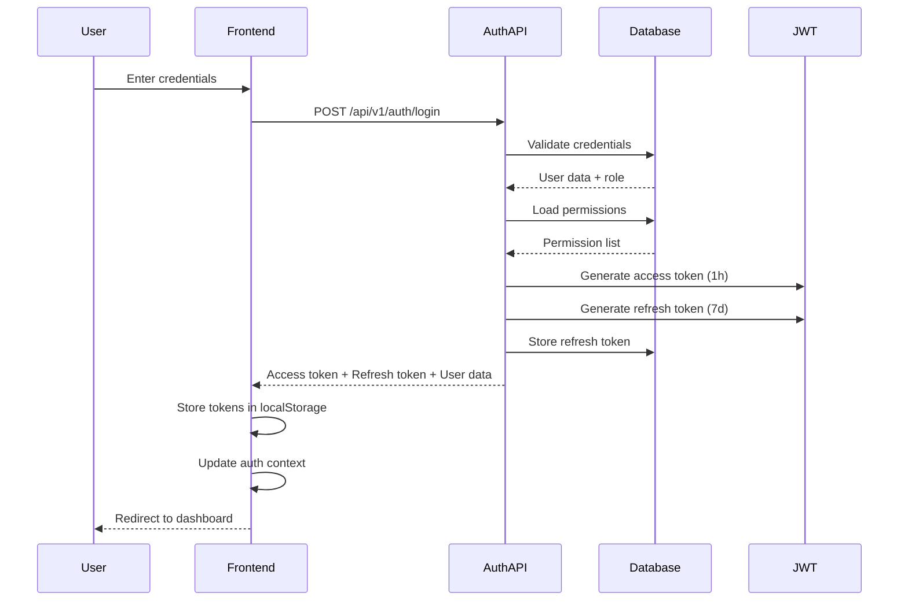
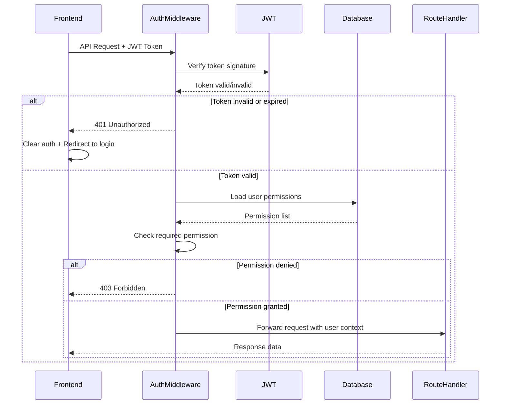
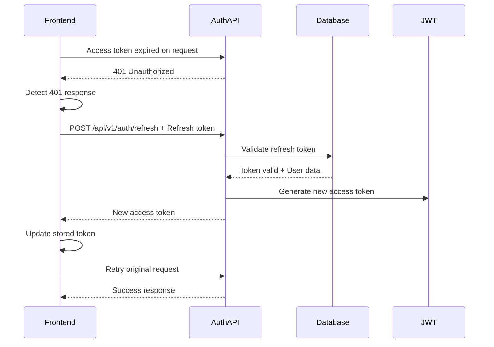
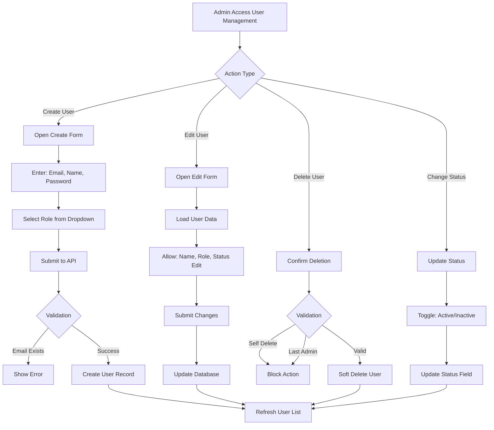
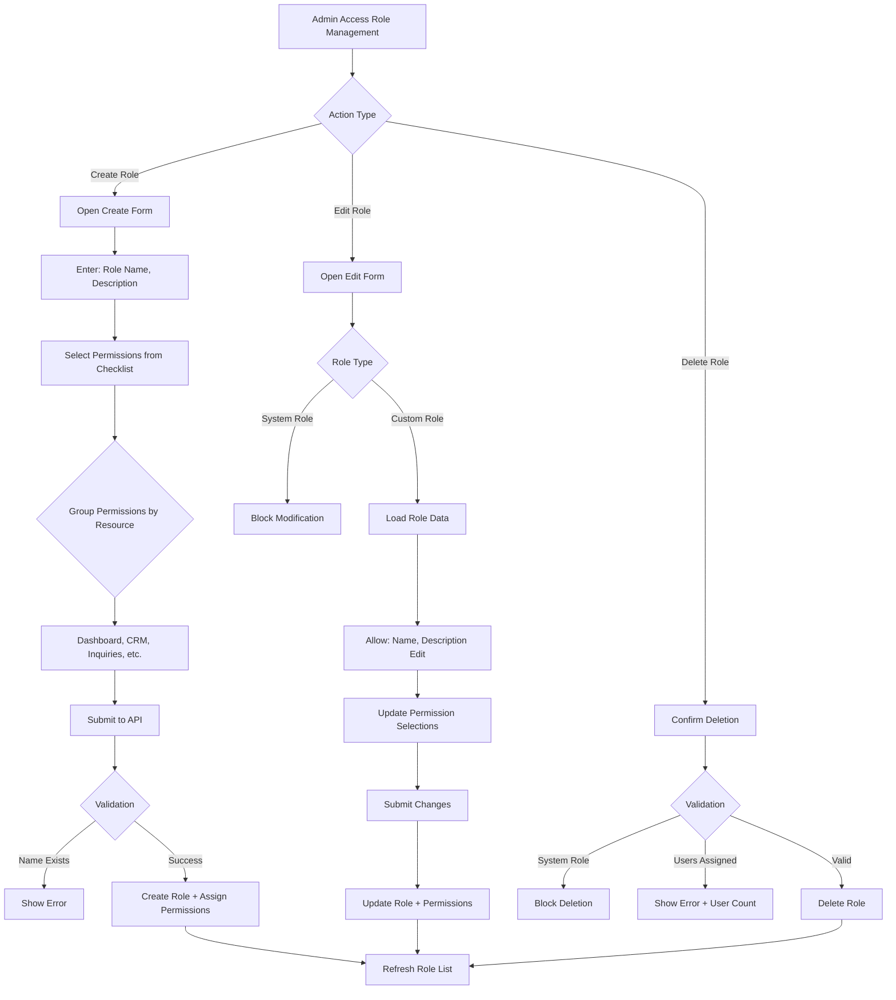

# JWT Role-Based Permission System

## Overview

This design defines a comprehensive JWT-based authentication and authorization system that enables granular, page-level access control for the Shop Orbit ERP application. The system allows administrators to dynamically manage users, create custom roles with configurable permissions, and control which pages different user types can access. The design migrates existing mock authentication to a production-ready, database-backed solution while maintaining backward compatibility during the transition.

## Business Objectives

- Enable multi-user access with role-based security controls
- Provide administrators with self-service user management capabilities
- Allow flexible permission configuration through custom role creation
- Secure API endpoints with JWT token validation
- Support scalable permission model that can grow with business needs
- Maintain session security with token expiration and refresh mechanisms

## System Constraints

- Must integrate with existing SQLite database infrastructure
- Must preserve current React Router navigation structure
- Must maintain compatibility with existing shadcn-ui components
- Must follow existing API patterns using TanStack Query
- JWT tokens must follow industry-standard security practices
- System must handle token expiration gracefully with auto-logout on 401 responses
- Must support multiple frontend origins for development environments

## Core Concepts

### Authentication vs Authorization

**Authentication** verifies user identity through credentials and issues a JWT token containing user identity and role information. **Authorization** validates the JWT token on each request and checks if the user's permissions allow access to the requested resource.

### Role-Based Access Control (RBAC)

Users are assigned to roles, and roles contain a collection of permissions. This abstraction layer simplifies permission management by grouping permissions into logical role definitions rather than assigning permissions individually to each user.

### JWT Token Structure

The JWT token contains three parts: header, payload, and signature. The payload includes user identity, role information, issued-at timestamp, and expiration timestamp. The server validates the signature to ensure token integrity and checks expiration on each protected request.

## Data Model

### Users Table

| Field | Type | Constraints | Description |
|-------|------|-------------|-------------|
| id | TEXT | PRIMARY KEY | Unique user identifier (UUID) |
| email | TEXT | UNIQUE, NOT NULL | User email for login |
| password_hash | TEXT | NOT NULL | Bcrypt hashed password |
| full_name | TEXT | NOT NULL | User's full display name |
| role_id | TEXT | FOREIGN KEY, NOT NULL | Reference to roles table |
| status | TEXT | NOT NULL | active, inactive, suspended |
| created_at | TEXT | NOT NULL | ISO 8601 timestamp |
| updated_at | TEXT | NOT NULL | ISO 8601 timestamp |
| last_login_at | TEXT | NULL | Last successful login timestamp |

### Roles Table

| Field | Type | Constraints | Description |
|-------|------|-------------|-------------|
| id | TEXT | PRIMARY KEY | Unique role identifier (UUID) |
| role_name | TEXT | UNIQUE, NOT NULL | Display name (e.g., "Admin", "Sales Manager") |
| role_key | TEXT | UNIQUE, NOT NULL | System identifier (e.g., "admin", "sales_manager") |
| description | TEXT | NULL | Role purpose description |
| is_system_role | INTEGER | NOT NULL, DEFAULT 0 | 1 for built-in roles, 0 for custom |
| created_at | TEXT | NOT NULL | ISO 8601 timestamp |
| updated_at | TEXT | NOT NULL | ISO 8601 timestamp |

### Permissions Table

| Field | Type | Constraints | Description |
|-------|------|-------------|-------------|
| id | TEXT | PRIMARY KEY | Unique permission identifier (UUID) |
| permission_key | TEXT | UNIQUE, NOT NULL | System identifier (e.g., "view_dashboard") |
| resource | TEXT | NOT NULL | Page or resource name (e.g., "dashboard", "crm") |
| action | TEXT | NOT NULL | Permission type: "view", "create", "edit", "delete" |
| description | TEXT | NULL | Human-readable description |
| created_at | TEXT | NOT NULL | ISO 8601 timestamp |

### Role Permissions Table

| Field | Type | Constraints | Description |
|-------|------|-------------|-------------|
| id | TEXT | PRIMARY KEY | Unique identifier (UUID) |
| role_id | TEXT | FOREIGN KEY, NOT NULL | Reference to roles table |
| permission_id | TEXT | FOREIGN KEY, NOT NULL | Reference to permissions table |
| created_at | TEXT | NOT NULL | ISO 8601 timestamp |

**Relationship**: Many-to-many relationship between roles and permissions through the role_permissions junction table.

### Refresh Tokens Table

| Field | Type | Constraints | Description |
|-------|------|-------------|-------------|
| id | TEXT | PRIMARY KEY | Unique identifier (UUID) |
| user_id | TEXT | FOREIGN KEY, NOT NULL | Reference to users table |
| token_hash | TEXT | UNIQUE, NOT NULL | Hashed refresh token |
| expires_at | TEXT | NOT NULL | Token expiration timestamp |
| created_at | TEXT | NOT NULL | ISO 8601 timestamp |
| revoked_at | TEXT | NULL | Revocation timestamp if invalidated |

## System Resources and Permissions

### Page Resources

The system recognizes the following page-level resources corresponding to application routes:

- **dashboard**: Main dashboard overview
- **crm**: Customer relationship management
- **inquiries**: Product inquiries management
- **orders**: Order processing and tracking
- **inventory**: Product inventory management
- **invoices**: Invoice generation and management
- **reports**: Business reporting and analytics
- **users**: User management (admin only)
- **roles**: Role and permission management (admin only)

### Permission Actions

For the initial implementation, only **view** action is required for page-level access control. Future iterations may expand to include create, edit, and delete actions for finer-grained control within pages.

### Default Permission Sets

**Admin Role Permissions**:
- Full access to all pages including users and roles management
- Can view and modify all system configurations
- Can create, edit, and delete users
- Can create, edit, and delete custom roles
- Can assign and revoke permissions

**Sales Agent Role Permissions**:
- Limited access to operational pages only
- Can view: dashboard, crm, inquiries, orders, inventory
- Cannot access: invoices, reports, users, roles

## Architecture Components

### Backend Components

#### Authentication Service

Handles user authentication operations including login, logout, token generation, and token refresh. Validates user credentials against database, generates JWT access tokens with 1-hour expiration, and issues refresh tokens with 7-day expiration stored in database.

#### Authorization Middleware

Express middleware that intercepts protected route requests, extracts and validates JWT tokens from Authorization header, verifies token signature and expiration, loads user permissions from database, and attaches user context to request object for downstream handlers.

#### User Management Service

Provides CRUD operations for user accounts including user creation with password hashing, user profile updates, status changes (activate/deactivate/suspend), and user deletion with cascading cleanup. Enforces business rules such as preventing self-deletion and admin count validation.

#### Role Management Service

Manages role definitions and permission assignments including custom role creation, role updates, permission assignment to roles, and role deletion with user reassignment validation. Prevents deletion of system roles and ensures at least one admin role exists.

#### Permission Service

Handles permission queries and validation including loading user permissions by user ID, checking specific permission existence, and retrieving all available permissions for role assignment interfaces.

### Frontend Components

#### Authentication Context Provider

React context that manages authentication state including current user information, JWT token storage, login and logout operations, and automatic token refresh on expiration. Provides authentication status and user data to all child components.

#### Permission Hook

Custom React hook that consumes authentication context and provides permission checking utilities. Exposes functions like hasPermission to check specific permissions and hasAnyPermission for conditional rendering based on user access.

#### Protected Route Component

Enhanced route wrapper that validates both authentication and authorization. Checks if user is authenticated and verifies user has required permission for the route. Redirects to login for unauthenticated users and shows forbidden page for unauthorized access.

#### User Management Page

Admin-only interface for managing user accounts including user list with search and filtering, create user form with role assignment, edit user details and role changes, and user activation/deactivation controls.

#### Role Management Page

Admin-only interface for managing roles and permissions including role list with custom/system indicators, create custom role form, permission assignment interface with grouped checkboxes, and role editing with permission updates.

## Authentication Flow

## Authorization Flow

## Token Refresh Flow

## User Management Flow

## Role Management Flow

## Security Considerations

### Password Security

All passwords must be hashed using bcrypt with a minimum cost factor of 10 before storage. Plaintext passwords must never be logged or stored. Password validation should enforce minimum length of 8 characters during user creation.

### JWT Token Security

Access tokens should have short expiration (1 hour) to limit exposure window. Refresh tokens should be stored hashed in database and have longer expiration (7 days). Token secrets must be stored in environment variables and never committed to version control. Token payload should contain minimal information (user ID, role, expiration).

### API Endpoint Protection

All API endpoints except login and health check must require valid JWT token. Middleware should validate token signature and expiration on every request. Failed authentication attempts should be logged for security monitoring. Rate limiting should be implemented on authentication endpoints to prevent brute force attacks.

### Permission Validation

Backend must always validate permissions even if frontend restricts UI access. Never trust client-side permission checks alone. Each protected endpoint should explicitly declare required permissions. Middleware should load fresh permissions from database for each request to ensure real-time updates.

### CORS Configuration

Backend should maintain explicit whitelist of allowed origins including development ports. CORS credentials must be enabled to support JWT token transmission. Production deployments should restrict origins to actual frontend domains only.

## Migration Strategy

### Phase 1: Database Setup

Create new authentication tables (users, roles, permissions, role_permissions, refresh_tokens) in the existing SQLite database. Run migration script to create tables with proper indexes and foreign key constraints. Seed initial data with system roles (Admin, Sales Agent) and default permissions for all pages.

### Phase 2: Backend Implementation

Implement authentication endpoints (login, logout, refresh, validate). Create authorization middleware for JWT validation and permission checking. Implement user management CRUD endpoints with proper validation. Implement role management endpoints for custom role creation and permission assignment. Add permission checks to existing API routes.

### Phase 3: Frontend Implementation

Update AuthContext to integrate with new authentication endpoints. Create permission checking hook for component-level access control. Enhance ProtectedRoute component to check specific permissions. Implement user management page for admin users. Implement role management page for permission configuration. Update navigation to hide inaccessible menu items based on permissions.

### Phase 4: Data Migration

Create migration script to convert existing mock users to database records. Map existing "owner" role to new "Admin" role with full permissions. Map existing "salesperson" role to new "Sales Agent" role with limited permissions. Preserve user credentials during migration for seamless transition.

### Phase 5: Testing and Validation

Test authentication flow with valid and invalid credentials. Verify permission checks across all protected routes. Test token expiration and automatic refresh mechanism. Validate admin capabilities for user and role management. Test edge cases (last admin deletion, role with assigned users, etc.). Verify CORS functionality across multiple development origins.

### Phase 6: Deployment

Remove mock authentication fallback code from production build. Update environment variables with secure JWT secret. Deploy database migrations to production database. Monitor authentication logs for any issues. Provide admin users with documentation for user and role management.

## API Contracts

### Authentication Endpoints

#### POST /api/v1/auth/login

Request body:
- email (string, required): User email
- password (string, required): User password

Response (200 OK):
- success (boolean): true
- data (object):
  - token (string): JWT access token
  - refreshToken (string): Refresh token for token renewal
  - user (object):
    - id (string): User ID
    - email (string): User email
    - name (string): Full name
    - role (object):
      - id (string): Role ID
      - name (string): Role name
      - key (string): Role key
    - permissions (array of strings): List of permission keys

Response (401 Unauthorized):
- success (boolean): false
- error (string): "Invalid credentials"

#### POST /api/v1/auth/refresh

Request body:
- refreshToken (string, required): Refresh token from login response

Response (200 OK):
- success (boolean): true
- data (object):
  - token (string): New JWT access token
  - refreshToken (string): New refresh token

Response (401 Unauthorized):
- success (boolean): false
- error (string): "Invalid or expired refresh token"

#### POST /api/v1/auth/logout

Headers:
- Authorization (string, required): Bearer {access_token}

Request body:
- refreshToken (string, required): Refresh token to revoke

Response (200 OK):
- success (boolean): true
- message (string): "Logged out successfully"

#### GET /api/v1/auth/me

Headers:
- Authorization (string, required): Bearer {access_token}

Response (200 OK):
- success (boolean): true
- data (object):
  - id (string): User ID
  - email (string): User email
  - name (string): Full name
  - role (object): Role information
  - permissions (array of strings): Permission keys

### User Management Endpoints

#### GET /api/v1/users

Headers:
- Authorization (string, required): Bearer {access_token}

Required permission: "view_users"

Query parameters:
- page (integer, optional, default: 1): Page number
- limit (integer, optional, default: 20): Items per page
- search (string, optional): Search by name or email
- status (string, optional): Filter by status (active, inactive, suspended)
- role_id (string, optional): Filter by role ID

Response (200 OK):
- success (boolean): true
- data (object):
  - users (array): List of user objects
  - pagination (object):
    - total (integer): Total user count
    - page (integer): Current page
    - limit (integer): Items per page
    - totalPages (integer): Total page count

#### POST /api/v1/users

Headers:
- Authorization (string, required): Bearer {access_token}

Required permission: "create_users"

Request body:
- email (string, required): User email
- password (string, required): User password (min 8 characters)
- full_name (string, required): User full name
- role_id (string, required): Role ID to assign

Response (201 Created):
- success (boolean): true
- data (object): Created user object (without password)

Response (400 Bad Request):
- success (boolean): false
- error (string): Validation error message

#### PUT /api/v1/users/:id

Headers:
- Authorization (string, required): Bearer {access_token}

Required permission: "edit_users"

Request body:
- full_name (string, optional): Updated full name
- role_id (string, optional): Updated role ID
- status (string, optional): Updated status

Response (200 OK):
- success (boolean): true
- data (object): Updated user object

Response (403 Forbidden):
- success (boolean): false
- error (string): "Cannot modify your own role or status"

#### DELETE /api/v1/users/:id

Headers:
- Authorization (string, required): Bearer {access_token}

Required permission: "delete_users"

Response (200 OK):
- success (boolean): true
- message (string): "User deleted successfully"

Response (403 Forbidden):
- success (boolean): false
- error (string): "Cannot delete yourself" or "Cannot delete last admin user"

### Role Management Endpoints

#### GET /api/v1/roles

Headers:
- Authorization (string, required): Bearer {access_token}

Required permission: "view_roles"

Response (200 OK):
- success (boolean): true
- data (array): List of role objects with permission counts

#### POST /api/v1/roles

Headers:
- Authorization (string, required): Bearer {access_token}

Required permission: "create_roles"

Request body:
- role_name (string, required): Display name for role
- description (string, optional): Role description
- permission_ids (array of strings, required): Permission IDs to assign

Response (201 Created):
- success (boolean): true
- data (object): Created role object with permissions

Response (400 Bad Request):
- success (boolean): false
- error (string): "Role name already exists"

#### PUT /api/v1/roles/:id

Headers:
- Authorization (string, required): Bearer {access_token}

Required permission: "edit_roles"

Request body:
- role_name (string, optional): Updated display name
- description (string, optional): Updated description
- permission_ids (array of strings, optional): Updated permission IDs

Response (200 OK):
- success (boolean): true
- data (object): Updated role object

Response (403 Forbidden):
- success (boolean): false
- error (string): "Cannot modify system roles"

#### DELETE /api/v1/roles/:id

Headers:
- Authorization (string, required): Bearer {access_token}

Required permission: "delete_roles"

Response (200 OK):
- success (boolean): true
- message (string): "Role deleted successfully"

Response (403 Forbidden):
- success (boolean): false
- error (string): "Cannot delete system roles"

Response (409 Conflict):
- success (boolean): false
- error (string): "Cannot delete role with assigned users"
- data (object):
  - userCount (integer): Number of users with this role

#### GET /api/v1/permissions

Headers:
- Authorization (string, required): Bearer {access_token}

Required permission: "view_roles"

Response (200 OK):
- success (boolean): true
- data (array): List of all available permissions grouped by resource

## Frontend Implementation Details

### Permission Hook Usage

The usePermission hook provides declarative permission checking throughout the application:

**Hook interface**:
- hasPermission(permissionKey: string): boolean - Check single permission
- hasAnyPermission(permissionKeys: string[]): boolean - Check if user has any of the listed permissions
- isAdmin(): boolean - Quick check for admin role

**Usage in components**: Wrap conditional content with permission checks to hide UI elements for unauthorized users. Use for both navigation menu items and in-page action buttons.

### Protected Route Enhancement

The ProtectedRoute component should be enhanced to accept a required permission parameter. When provided, the component validates the user has the specified permission before rendering children. If permission is missing, render a Forbidden component instead of redirecting.

**Enhanced interface**:
- children (ReactNode): Protected content
- requiredPermission (string, optional): Permission key required for access
- fallback (ReactNode, optional): Custom forbidden UI

### Authentication State Management

The AuthContext should maintain:
- user (User | null): Current user data with role and permissions
- isAuthenticated (boolean): Authentication status
- isLoading (boolean): Loading state during token validation
- login(email, password): Promise - Authenticate user
- logout(): void - Clear authentication
- refreshToken(): Promise - Renew access token

Token refresh should be triggered automatically when API returns 401 response. Implement retry logic that attempts refresh once before forcing logout.

### API Integration Pattern

All API calls should use the existing apiFetch wrapper from lib/api.ts. The wrapper automatically:
- Attaches JWT token to Authorization header
- Handles 401 responses by triggering logout
- Parses JSON responses with type safety

User and role management should be implemented using TanStack Query with:
- refetchOnWindowFocus: false
- retry: 1
- Type-safe interfaces for all responses

### Navigation Menu Permissions

The AppLayout component should filter navigation menu items based on user permissions. Each menu item should declare its required permission. Items without matching permissions should be hidden from the navigation sidebar.

**Menu item structure**:
- label (string): Display text
- path (string): Route path
- icon (ReactNode): Menu icon
- requiredPermission (string): Permission key needed to view

## Testing Considerations

### Authentication Testing

Verify login succeeds with valid credentials and returns expected token structure. Verify login fails with invalid credentials and returns 401 status. Test token expiration by waiting for timeout and verifying auto-logout. Test token refresh mechanism extends session without re-login. Verify logout clears all stored tokens and redirects to login page.

### Authorization Testing

Test protected routes redirect unauthenticated users to login. Test users can only access pages matching their permissions. Test API endpoints reject requests without valid token. Test API endpoints reject requests without required permissions. Verify permission changes reflect immediately without requiring re-login.

### User Management Testing

Test admin can create users with all required fields. Test email uniqueness validation prevents duplicate accounts. Test admin can update user roles and status. Test admin cannot delete themselves. Test admin cannot delete last admin user. Test inactive users cannot login.

### Role Management Testing

Test admin can create custom roles with selected permissions. Test role name uniqueness validation. Test system roles cannot be modified or deleted. Test roles with assigned users cannot be deleted. Test permission changes to roles reflect for assigned users.

### Edge Case Testing

Test behavior when JWT secret changes (all tokens invalid). Test concurrent login sessions from same user. Test permission revocation while user is active. Test database connection loss during authentication. Test malformed JWT token handling. Test expired refresh token behavior.

## Performance Considerations

### Database Indexing

Create indexes on frequently queried fields:
- users.email for login lookups
- users.role_id for permission loading
- roles.role_key for role lookups
- permissions.permission_key for permission checks
- role_permissions.role_id and permission_id for joins
- refresh_tokens.token_hash for refresh validation

### Permission Caching

The JWT token payload should include user permissions to avoid database lookup on every request. Middleware should decode token and use embedded permissions for validation. Only reload permissions from database when token is refreshed. This approach trades token size for database query reduction.

### Query Optimization

User list endpoint should use pagination to limit result set size. Role and permission queries should use JOIN operations to minimize round trips. Implement database connection pooling even with SQLite for concurrent request handling. Use prepared statements to improve query performance and prevent SQL injection.

### Frontend Optimization

Cache user permissions in AuthContext to avoid repeated prop drilling. Use React.memo for permission-wrapped components to prevent unnecessary re-renders. Debounce search inputs in user and role management pages. Implement optimistic updates for better perceived performance on user actions.

## Monitoring and Logging

### Authentication Events

Log successful logins with user ID and timestamp for audit trail. Log failed login attempts with email and IP address for security monitoring. Log token refresh events to track session extensions. Log logout events to complete session lifecycle. Alert on unusual patterns like rapid failed login attempts.

### Authorization Failures

Log 403 responses with user ID and attempted resource for access pattern analysis. Track permission check failures to identify misconfigured roles. Monitor token expiration patterns to optimize timeout settings. Log role and permission changes for audit compliance.

### System Health

Monitor authentication endpoint response times to detect performance degradation. Track token refresh success rate to identify expiration issues. Monitor database query performance for permission lookups. Alert on authentication service failures to ensure system availability.

## Deployment Configuration

### Environment Variables

Required environment variables for production deployment:

- JWT_SECRET: Secret key for token signing (minimum 32 characters, cryptographically random)
- JWT_ACCESS_TOKEN_EXPIRY: Access token expiration (default: "1h")
- JWT_REFRESH_TOKEN_EXPIRY: Refresh token expiration (default: "7d")
- BCRYPT_ROUNDS: Password hashing cost factor (default: 10)
- CORS_ORIGIN: Allowed frontend origin for production

### Database Migration

Provide SQL migration script that can be executed independently. Include rollback script for emergency reversion. Document required database backup before migration. Test migration on staging environment before production deployment.

### Initial Admin User

Migration script should create initial admin user with known credentials. Admin should be prompted to change password on first login. Document default admin credentials securely for deployment team. Ensure at least one admin exists before deactivating mock authentication.

## Future Enhancements

### Action-Level Permissions

Expand beyond page-level access to include create, edit, and delete actions within pages. Modify permission model to include action field in permission checks. Update UI to conditionally render action buttons based on granular permissions.

### Permission Inheritance

Implement permission hierarchy where higher-level permissions automatically grant lower-level access. Define parent-child relationships between permissions. Simplify role configuration by reducing redundant permission selections.

### User Groups

Introduce user groups that can be assigned permissions in addition to roles. Allow users to belong to multiple groups for flexible permission composition. Useful for cross-functional team members who need hybrid access.

### Audit Trail

Create audit log table to track all permission changes, role modifications, and user actions. Provide admin interface to view audit history with filtering and search. Implement retention policies for log data management.

### Multi-Factor Authentication

Add optional MFA layer for enhanced security on sensitive accounts. Support TOTP-based authenticator apps for second factor. Require MFA for admin users and make optional for regular users.

### API Key Authentication

Provide alternative authentication mechanism for programmatic API access. Generate long-lived API keys with scoped permissions. Useful for integrations and automated workflows that cannot use session-based auth.

### Session Management

Allow users to view active sessions across devices. Provide ability to revoke specific sessions remotely. Display session information like device type, location, and last activity timestamp.

### Password Policies

Implement configurable password strength requirements. Add password expiration and rotation policies. Track password history to prevent reuse of recent passwords.
