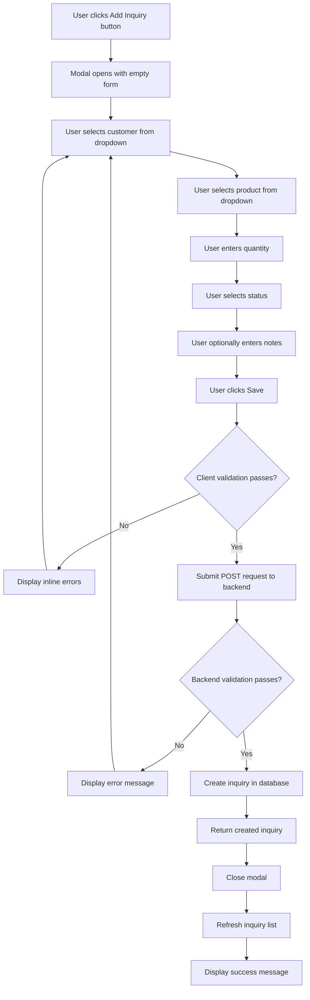
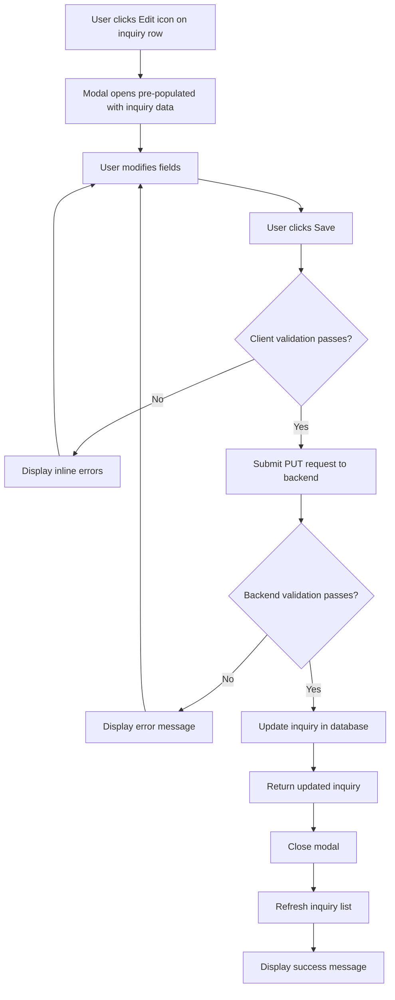
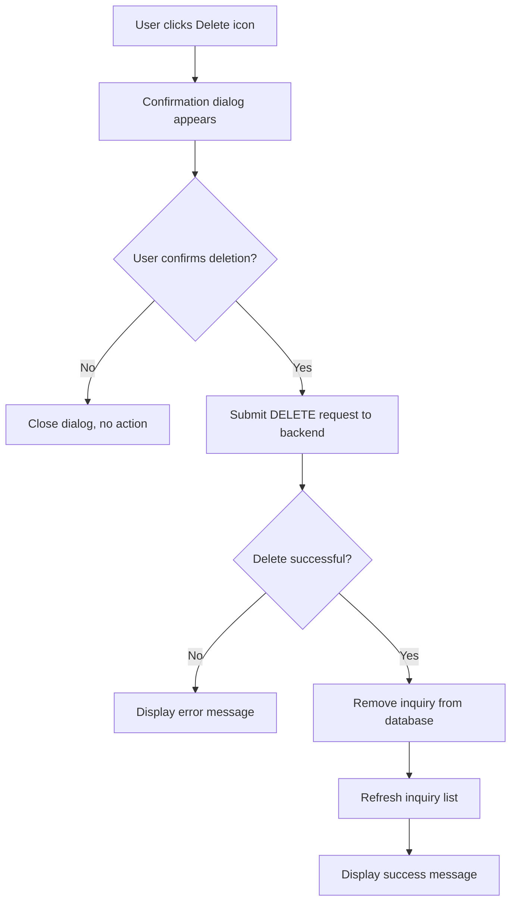
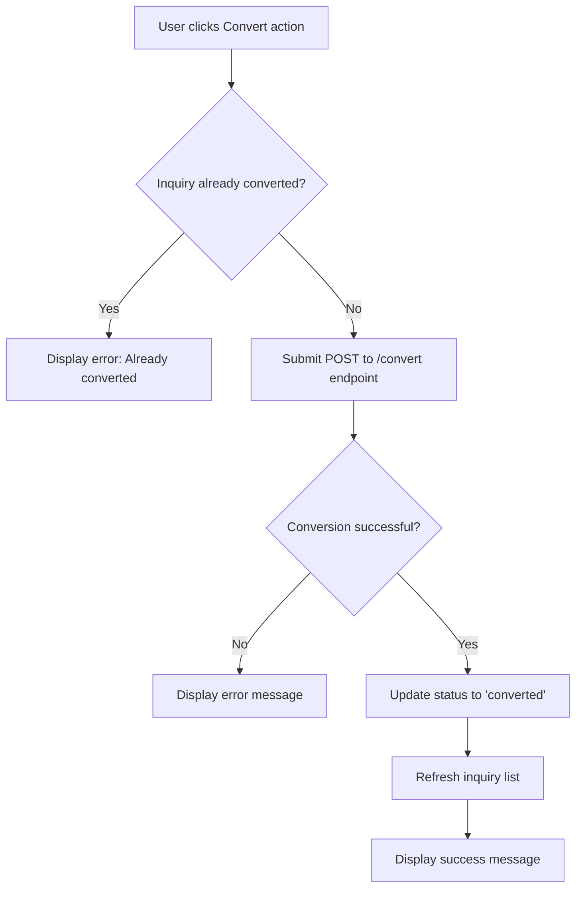
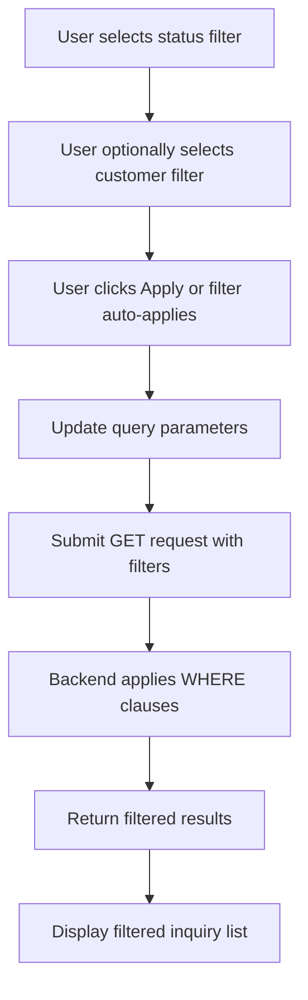

# Sales Inquiry Management - Full Implementation Design

## Overview

This design document specifies the complete implementation of the Sales Inquiry Management page, enabling users to create, view, edit, delete, and manage sales inquiries with full CRUD operations and status workflow management.

## Business Context

Sales inquiries represent customer requests for product quotations. The inquiry lifecycle flows from initial inquiry creation through status transitions (pending, converted to order, or rejected), providing a systematic approach to tracking and managing customer interest in products.

## Functional Requirements

### Core Features

#### 1. Inquiry List View
- Display all inquiries in a tabular format with pagination support
- Show enriched data including customer name and product name (joined from related tables)
- Display key inquiry attributes: customer, product, quantity, status, notes, creation date
- Support filtering by status (pending, converted, rejected)
- Support filtering by customer
- Provide sorting capabilities on relevant columns
- Show loading state during data fetching
- Show error state with retry option when data fetch fails
- Show empty state when no inquiries exist with prompt to create first inquiry

#### 2. Create New Inquiry
- Open modal dialog form for inquiry creation
- Collect required fields:
  - Customer selection (dropdown populated from customers table)
  - Product selection (dropdown populated from products table)
  - Quantity (positive integer, minimum 1)
  - Status (dropdown: pending, converted, rejected)
  - Notes (optional text area, max 1000 characters)
- Validate all required fields before submission
- Display validation errors inline
- Show loading state during submission
- Auto-refresh inquiry list after successful creation
- Display success message confirmation
- Handle and display API errors appropriately

#### 3. Edit Existing Inquiry
- Open modal dialog pre-populated with existing inquiry data
- Allow modification of all inquiry fields
- Maintain same validation rules as creation
- Support partial updates (only modified fields sent to backend)
- Show loading state during update operation
- Auto-refresh inquiry list after successful update
- Display success message confirmation
- Handle and display API errors appropriately

#### 4. Delete Inquiry
- Trigger confirmation dialog before deletion
- Display warning message with inquiry details
- Execute hard delete operation upon confirmation
- Auto-refresh inquiry list after successful deletion
- Display success message confirmation
- Handle and display API errors appropriately
- Prevent accidental deletions with explicit user confirmation

#### 5. Inquiry Status Management
- Support status workflow transitions
- Convert inquiry to order via dedicated action (status changes to 'converted')
- Reject inquiry via dedicated action (status changes to 'rejected', allow adding rejection notes)
- Prevent duplicate conversions (validate inquiry not already converted)
- Display appropriate visual indicators for each status (color-coded tags)

#### 6. View Inquiry Details
- Display enriched inquiry information including:
  - Customer details (name, email, phone)
  - Product details (part number, description, category)
  - Inquiry metadata (quantity, status, notes, timestamps)
- Support quick access from inquiry list

## Data Model

### Inquiry Entity

| Field | Type | Constraints | Description |
|-------|------|-------------|-------------|
| id | string | Primary key, auto-generated | Unique inquiry identifier |
| customer_id | string | Required, foreign key to customers | Reference to customer entity |
| product_id | string | Required, foreign key to products | Reference to product entity |
| quantity | integer | Required, positive, minimum 1 | Requested product quantity |
| status | string | Required, enum: pending, converted, rejected | Current inquiry status |
| notes | string | Optional, max 1000 characters | Additional inquiry notes |
| created_at | string | Auto-generated ISO timestamp | Inquiry creation timestamp |
| updated_at | string | Auto-updated ISO timestamp | Last modification timestamp |

### Enriched Inquiry View (Read Operations)

The backend enriches inquiry data with related entity information through SQL joins:

| Additional Field | Source | Description |
|-----------------|--------|-------------|
| customer_name | customers.customer_name | Customer display name |
| product_name | products.part_no | Product part number |
| email | customers.email | Customer email (detail view) |
| phone | customers.phone | Customer phone (detail view) |
| product_description | products.description | Product description (detail view) |
| product_category | products.category | Product category (detail view) |

## User Interface Structure

### Page Layout

```
┌─────────────────────────────────────────────────────────────┐
│ Inquiries                                    [+ Add Inquiry] │
├─────────────────────────────────────────────────────────────┤
│ Filters:                                                     │
│ Status: [Dropdown ▼]  Customer: [Dropdown ▼]  [Apply]       │
├─────────────────────────────────────────────────────────────┤
│ ┌───────────────────────────────────────────────────────┐   │
│ │ Customer    │ Product   │ Qty │ Status  │ Notes │ ... │   │
│ ├───────────────────────────────────────────────────────┤   │
│ │ ABC Corp    │ PT-1001   │ 100 │ Pending │ ...   │ ✎ 🗑 │   │
│ │ XYZ Ltd     │ PT-2005   │ 50  │ Convert │ ...   │ ✎ 🗑 │   │
│ │ ...         │ ...       │ ... │ ...     │ ...   │ ... │   │
│ └───────────────────────────────────────────────────────┘   │
│                                        Page 1 of 10 [< >]    │
└─────────────────────────────────────────────────────────────┘
```

### Create/Edit Modal Form

```
┌────────────────────────────────────────┐
│ Add Inquiry / Edit Inquiry       [×]   │
├────────────────────────────────────────┤
│ Customer *                             │
│ [Select customer...            ▼]      │
│                                        │
│ Product *                              │
│ [Select product...             ▼]      │
│                                        │
│ Quantity *                             │
│ [   100   ]                            │
│                                        │
│ Status *                               │
│ [Pending                       ▼]      │
│                                        │
│ Notes                                  │
│ ┌──────────────────────────────────┐   │
│ │                                  │   │
│ │                                  │   │
│ └──────────────────────────────────┘   │
│                                        │
│              [Cancel]  [Save]          │
└────────────────────────────────────────┘
```

### Status Visual Indicators

| Status | Color | Visual Treatment |
|--------|-------|-----------------|
| pending | Blue | Blue tag badge |
| converted | Green | Green tag badge |
| rejected | Red | Red tag badge |

## API Integration

### Endpoints Used

#### 1. List Inquiries
- **Method**: GET
- **Path**: /api/v1/inquiries
- **Query Parameters**:
  - status (optional): Filter by status
  - customer_id (optional): Filter by customer
  - limit (optional): Results per page (default 100)
  - offset (optional): Pagination offset (default 0)
- **Response**: Paginated list of enriched inquiries

#### 2. Get Inquiry Details
- **Method**: GET
- **Path**: /api/v1/inquiries/:id
- **Response**: Single enriched inquiry with full customer and product details

#### 3. Create Inquiry
- **Method**: POST
- **Path**: /api/v1/inquiries
- **Request Body**:
  - customer_id (required)
  - product_id (required)
  - quantity (required)
  - status (required)
  - notes (optional)
- **Response**: Created inquiry object with HTTP 201 status

#### 4. Update Inquiry
- **Method**: PUT
- **Path**: /api/v1/inquiries/:id
- **Request Body**: Partial inquiry object (only fields to update)
- **Response**: Updated inquiry object

#### 5. Delete Inquiry
- **Method**: DELETE
- **Path**: /api/v1/inquiries/:id
- **Response**: HTTP 204 No Content on success

#### 6. Convert Inquiry to Order
- **Method**: POST
- **Path**: /api/v1/inquiries/:id/convert
- **Response**: Updated inquiry with status 'converted'

#### 7. Reject Inquiry
- **Method**: POST
- **Path**: /api/v1/inquiries/:id/reject
- **Request Body**:
  - notes (optional): Rejection reason
- **Response**: Updated inquiry with status 'rejected'

#### 8. Get Inquiry Statistics
- **Method**: GET
- **Path**: /api/v1/inquiries/stats
- **Response**: Aggregated statistics by status

### Supporting Endpoints

#### List Customers
- **Method**: GET
- **Path**: /api/v1/customers
- **Usage**: Populate customer dropdown in inquiry form

#### List Products
- **Method**: GET
- **Path**: /api/v1/products
- **Usage**: Populate product dropdown in inquiry form

## State Management

### Frontend State Using TanStack Query

#### Query Keys Structure

```
inquiries: ['inquiries']
inquiries with filters: ['inquiries', { status, customer_id }]
single inquiry: ['inquiries', id]
customers: ['customers']
products: ['products']
inquiry stats: ['inquiries', 'stats']
```

#### Cache Invalidation Strategy

After mutation operations (create, update, delete, convert, reject), invalidate and refetch the following query keys:
- ['inquiries'] - Refresh inquiry list
- ['inquiries', 'stats'] - Refresh statistics if displayed

### Form State

Managed by Ant Design Form instance with the following behavior:
- On modal open for create: Reset form to initial empty state
- On modal open for edit: Pre-populate form with existing inquiry data using setFieldsValue
- On modal close: Clear form state
- On successful submission: Reset form and close modal

### UI State

| State Variable | Type | Purpose |
|----------------|------|---------|
| isModalOpen | boolean | Controls modal visibility |
| editingInquiry | Inquiry or null | Tracks whether in create or edit mode |

## Validation Rules

### Client-Side Validation

| Field | Rule | Error Message |
|-------|------|---------------|
| customer_id | Required | Customer is required |
| product_id | Required | Product is required |
| quantity | Required, integer, minimum 1 | Quantity must be at least 1 |
| status | Required, one of: pending, converted, rejected | Status is required |
| notes | Optional, max length 1000 | Notes must not exceed 1000 characters |

### Backend Validation

The backend performs the same validations plus:
- Verify customer_id exists in customers table
- Verify product_id exists in products table
- Return 404 error if referenced entities not found
- Return 400 error for validation failures with detailed error messages

## User Workflows

### Workflow 1: Create New Inquiry



### Workflow 2: Edit Existing Inquiry



### Workflow 3: Delete Inquiry



### Workflow 4: Convert Inquiry to Order



### Workflow 5: Filter Inquiries



## Component Architecture

### Main Component: Inquiries Page

**Responsibilities**:
- Orchestrate overall page layout and state
- Manage modal visibility and edit mode state
- Handle user interactions (add, edit, delete actions)
- Coordinate data fetching and mutations

**Key Elements**:
- Page header with title and Add Inquiry button
- Filter controls (status, customer dropdowns)
- Inquiry table component
- Create/Edit modal dialog
- Delete confirmation dialog

### Sub-Components

#### InquiryTable
- Render tabular data with columns: Customer, Product, Quantity, Status, Notes, Actions
- Support row selection for actions
- Display status with color-coded tags
- Show action buttons (Edit, Delete) per row
- Handle loading and empty states

#### InquiryFormModal
- Display form fields with validation
- Pre-populate data for edit mode
- Reset form for create mode
- Handle form submission
- Display validation errors

#### StatusTag
- Render status with appropriate color
- Apply consistent styling across application

## Error Handling Strategy

### Network Errors
- Display user-friendly error messages via toast notifications
- Provide retry mechanism for failed requests
- Show full error state with retry button on initial page load failure

### Validation Errors
- Display inline field-level errors from client validation
- Display API validation errors as toast notifications
- Highlight invalid fields in form

### Not Found Errors (404)
- When viewing/editing non-existent inquiry, display message and redirect to list
- When referenced customer/product not found during creation, display clear error message

### Permission Errors (403)
- Display "Insufficient permissions" message
- Disable action buttons for unauthorized operations

### Session Expiry (401)
- Automatically redirect to login page
- Clear authentication token from storage
- Display "Session expired" message

## Performance Considerations

### Query Optimization
- Use TanStack Query caching to minimize redundant API calls
- Set appropriate staleTime (5 minutes) to balance freshness and performance
- Enable background refetching for data consistency

### Pagination
- Limit default page size to 100 inquiries
- Implement offset-based pagination for large datasets
- Provide pagination controls for navigation

### Lazy Loading
- Load customers and products lists only when modal opens
- Cache dropdown data to avoid repeated fetches

### Optimistic Updates
- Consider implementing optimistic UI updates for delete operations to improve perceived performance
- Roll back on error and display appropriate message

## Security Considerations

### Authentication
- All API requests include JWT token in Authorization header
- Redirect to login on 401 responses
- Store token securely in localStorage

### Authorization
- Backend validates user permissions for each operation
- Frontend respects backend authorization decisions
- Display appropriate error messages for forbidden operations

### Data Validation
- Client-side validation for user experience
- Server-side validation as security measure
- Prevent SQL injection through parameterized queries (handled by backend)

### Input Sanitization
- Limit notes field length to prevent abuse
- Validate numeric inputs (quantity) to prevent invalid data
- Validate enum values (status) against allowed set

## Testing Scenarios

### Happy Path Tests
1. Create inquiry with all required fields
2. Edit inquiry and update quantity
3. Delete inquiry successfully
4. Filter inquiries by status
5. Convert inquiry to order
6. Reject inquiry with notes

### Edge Cases
1. Create inquiry with maximum notes length (1000 characters)
2. Create inquiry with minimum quantity (1)
3. Edit inquiry and change only status field
4. Filter by non-existent customer (returns empty list)
5. Attempt to convert already converted inquiry (displays error)

### Error Scenarios
1. Submit form with missing required fields
2. Submit form with invalid quantity (zero or negative)
3. Attempt to delete non-existent inquiry
4. Network failure during inquiry creation
5. Backend validation error (customer not found)
6. Session expired during form submission

### UI/UX Tests
1. Modal opens correctly in create mode with empty form
2. Modal opens correctly in edit mode with pre-populated data
3. Form resets correctly when switching between create and edit modes
4. Loading spinner displays during data fetching
5. Success messages display after successful operations
6. Error messages display for failed operations
7. Confirmation dialog appears before deletion
8. Empty state displays when no inquiries exist

## Implementation Checklist

### Frontend Tasks

- [ ] Update TypeScript types if needed to match enriched inquiry structure
- [ ] Ensure useApi hooks properly handle inquiry queries and mutations
- [ ] Implement inquiry list table with all required columns
- [ ] Implement status filter dropdown
- [ ] Implement customer filter dropdown
- [ ] Implement Add Inquiry button and modal trigger
- [ ] Implement create inquiry form with validation
- [ ] Implement edit inquiry functionality
- [ ] Implement delete inquiry with confirmation dialog
- [ ] Implement status tag rendering with color coding
- [ ] Implement loading states for all async operations
- [ ] Implement error states with retry options
- [ ] Implement empty state with helpful message
- [ ] Implement success/error toast notifications
- [ ] Add form reset logic for create vs edit modes
- [ ] Implement query cache invalidation after mutations
- [ ] Test all user workflows end-to-end
- [ ] Handle edge cases and error scenarios

### Backend Verification

- [ ] Verify all inquiry endpoints are functional
- [ ] Verify validation rules are enforced
- [ ] Verify foreign key constraints work correctly
- [ ] Verify enriched queries return customer and product names
- [ ] Verify pagination works correctly
- [ ] Verify filtering by status and customer works
- [ ] Verify convert and reject endpoints function properly
- [ ] Verify error responses include helpful messages

### Integration Testing

- [ ] Test complete create inquiry flow
- [ ] Test complete edit inquiry flow
- [ ] Test complete delete inquiry flow
- [ ] Test filtering functionality
- [ ] Test pagination with large datasets
- [ ] Test error handling for all failure scenarios
- [ ] Test concurrent user operations
- [ ] Verify data consistency after operations

## Future Enhancements

### Potential Features
- Bulk inquiry creation from CSV import
- Inquiry search by product part number or customer name
- Advanced filtering with date range selection
- Export inquiries to Excel/CSV
- Email notifications on inquiry status changes
- Inquiry activity timeline/audit log
- Attach files or images to inquiries
- Auto-convert inquiry to order with single click
- Inquiry analytics dashboard with conversion rates
- Customer inquiry history view
- Product inquiry popularity trends
