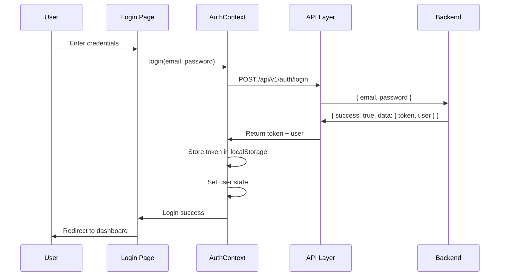
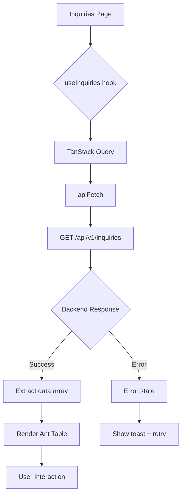
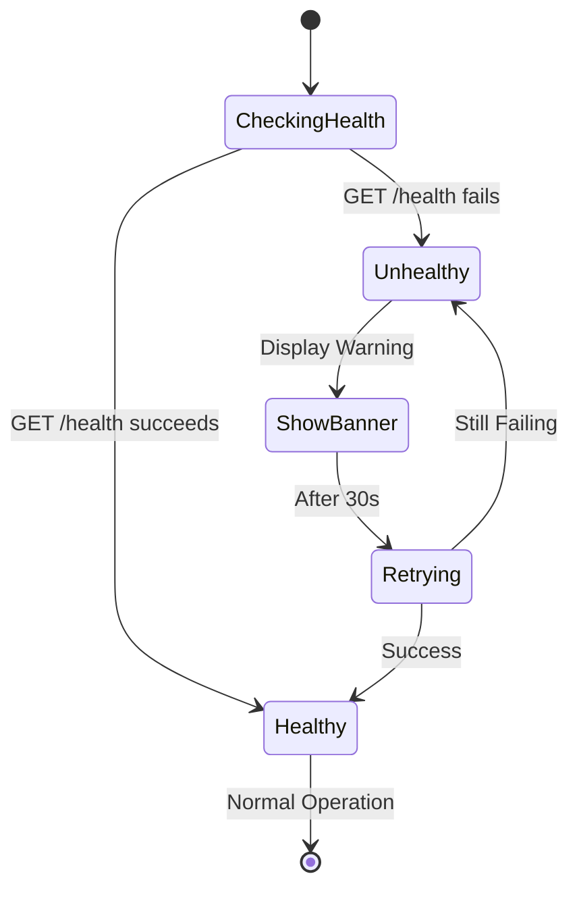
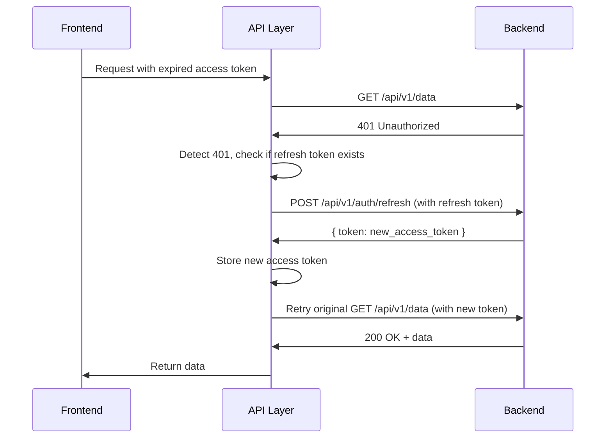
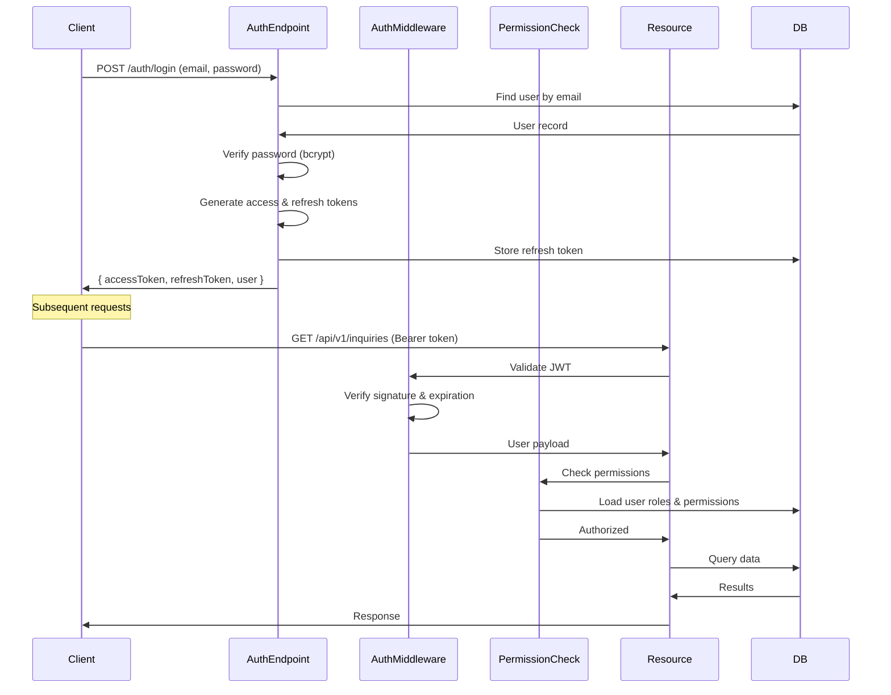

# Wire Backend API into Frontend

## Objective

Connect the React frontend to the Express backend API, replacing localStorage-based mockData with live API calls using TanStack Query and native fetch. Enable real-time data display with proper loading, empty, and error states.

## Context

**Frontend Stack:**
- React 18 with TypeScript
- Vite build tool
- TanStack Query v5 for data fetching
- Tailwind CSS with shadcn-ui components
- Path alias: `@/*` → `src/*`

**Backend Stack:**
- Express REST API on port 3001
- Endpoints under `/api/v1`
- CORS configured for `http://localhost:5173`
- Response format: `{ success: boolean, data: T }` or paginated structure

**Target Pages:**
- `src/pages/Inquiries.tsx` - currently using Ant Design Table with mockData
- `src/pages/CRM.tsx` - customer management
- `src/pages/Inventory.tsx` - product inventory

## Design Overview

The integration follows a layered architecture:

1. **API Layer** - Base configuration and HTTP utilities
2. **Type Layer** - TypeScript models matching backend schema
3. **Data Layer** - TanStack Query hooks for data fetching
4. **UI Layer** - Page components consuming hooks with UX states

## Design Components

### 1. JWT Authentication Integration

#### 1.1 Authentication Flow

**Current State:**
- Frontend has AuthContext with localStorage-based user state
- Backend has no authentication middleware (future implementation)
- CORS already configured with `Authorization` header support

**JWT-Compatible Design:**

**Token Storage Strategy:**

| Storage Location | Use Case | Security Level |
|-----------------|----------|----------------|
| localStorage | JWT token persistence | Medium (vulnerable to XSS) |
| httpOnly cookie | Preferred for production | High (XSS-resistant) |
| sessionStorage | Non-persistent sessions | Medium |

**Recommendation:** Store JWT in localStorage initially, migrate to httpOnly cookies for production.

**Authentication State Flow:**



#### 1.2 Token Management

**Token Lifecycle:**

| Event | Action | Implementation |
|-------|--------|----------------|
| Login success | Store token in localStorage as `auth_token` | `localStorage.setItem('auth_token', token)` |
| API request | Attach token to Authorization header | `Authorization: Bearer ${token}` |
| Token expired | Clear storage, redirect to login | Detect 401 response |
| Logout | Remove token from storage | `localStorage.removeItem('auth_token')` |
| Token refresh | Exchange refresh token for new access token | Future enhancement |

**Token Retrieval Helper:**

The API layer will include a `getAuthToken()` utility that:
- Reads token from `localStorage.getItem('auth_token')`
- Returns null if not found or expired (basic check)
- Used by `apiFetch` to attach to requests

#### 1.3 Protected API Requests

**Header Injection Strategy:**

Every authenticated API request must include:
```
Authorization: Bearer {jwt_token}
Content-Type: application/json
```

The `apiFetch` function will automatically:
1. Retrieve token via `getAuthToken()`
2. Attach to headers if token exists
3. Proceed without auth header for public endpoints (like `/health`, `/auth/login`)

**Public vs Protected Endpoints:**

| Endpoint | Auth Required | Rationale |
|----------|---------------|-----------||
| GET /health | No | Health check accessible to monitoring |
| POST /api/v1/auth/login | No | Authentication endpoint |
| POST /api/v1/auth/register | No | User registration (if enabled) |
| GET /api/v1/inquiries | Yes | Protected business data |
| GET /api/v1/customers | Yes | Protected business data |
| GET /api/v1/products | Yes | Protected business data |
| All POST/PUT/DELETE | Yes | Mutating operations require auth |

#### 1.4 Unauthorized Response Handling

**401 Unauthorized Strategy:**

When backend returns 401:
1. `apiFetch` detects response status
2. Clear auth token from localStorage
3. Clear user from AuthContext
4. Redirect to `/login` page
5. Show toast: "Session expired. Please login again."

**Implementation Pattern:**
```
If response.status === 401:
  - localStorage.removeItem('auth_token')
  - localStorage.removeItem('erp_user')
  - Trigger global auth state reset
  - window.location.href = '/login'
```

**403 Forbidden Strategy:**

When backend returns 403 (authenticated but not authorized):
1. Show error toast: "You don't have permission to access this resource"
2. Don't redirect or clear token
3. Log attempt for audit purposes

#### 1.5 AuthContext Enhancement

**Current Implementation:**
- Stores user object in localStorage (`erp_user`)
- Mock login with hardcoded users
- No backend integration

**Required Changes:**

| Aspect | Current | JWT-Compatible |
|--------|---------|----------------|
| Login method | Mock authentication | POST to `/api/v1/auth/login` |
| Token storage | None | Store JWT in `localStorage.setItem('auth_token', token)` |
| User persistence | `erp_user` in localStorage | Keep user object + separate token |
| Logout | Clear `erp_user` only | Clear both `erp_user` AND `auth_token` |
| Auto-logout | None | On 401 response from any API call |

**Updated AuthContext Responsibilities:**
1. Manage user state (current)
2. Store and retrieve JWT token
3. Provide token to API layer
4. Handle global logout on auth failure
5. Check token expiration on app load (optional)

#### 1.6 Login Flow Integration

**Backend Endpoint (Future):**
```
POST /api/v1/auth/login
Request: { email: string, password: string }
Response: {
  success: true,
  data: {
    token: string (JWT),
    user: { id, email, name, role }
  }
}
```

**Frontend Login Page Update:**

The existing `src/pages/Login.tsx` should:
1. Call `AuthContext.login(email, password)`
2. AuthContext calls `apiFetch('/api/v1/auth/login', { method: 'POST', body: { email, password } })`
3. On success, extract token and user from response
4. Store token in localStorage as `auth_token`
5. Store user in localStorage as `erp_user` (keep existing pattern)
6. Update AuthContext state
7. Redirect to dashboard

**Backward Compatibility:**

Until backend auth is implemented:
- Keep mock authentication in AuthContext
- Generate a fake JWT token for testing: `"mock-jwt-token-" + Date.now()`
- API calls work without real token validation
- Allows frontend development to proceed

### 2. API Base Configuration

#### 1.1 Environment Variable

**Variable:** `VITE_API_BASE_URL`

**Purpose:** Allow backend URL configuration without code changes

**Default Value:** `http://localhost:3001`

**Usage Pattern:**
- Read via `import.meta.env.VITE_API_BASE_URL`
- Applied at runtime during fetch calls
- Enables different backends for dev/staging/production

#### 1.2 API Helper Module

**Location:** `src/lib/api.ts`

**Responsibilities:**
- Centralize fetch configuration
- Handle JSON serialization/deserialization
- Standardize error handling
- Abstract base URL resolution

**Functions:**

| Function | Purpose | Return Type |
|----------|---------|-------------|
| `getAuthToken()` | Retrieve JWT token from localStorage | `string \| null` |
| `buildUrl(path)` | Construct full URL from relative path | `string` |
| `apiFetch<T>(path, options?)` | Execute fetch with JWT auth header, error handling, and JSON parsing | `Promise<T>` |

**Error Handling Strategy:**
- Throw errors for non-2xx responses
- Include response body in error message
- Preserve HTTP status codes for caller handling
- Special handling for 401: trigger global logout
- Special handling for 403: show permission error

**Authentication Header Injection:**

The `apiFetch` function automatically includes authentication:

| Condition | Authorization Header | Behavior |
|-----------|---------------------|----------|
| Token exists in localStorage | `Bearer {token}` | Include in all requests |
| Token not found | Omitted | Allow request (for public endpoints) |
| Public endpoint (e.g., /auth/login) | Omitted | Explicitly skip auth header |

**apiFetch Pseudocode Flow:**
```
1. Get token from getAuthToken()
2. Merge default headers: { 'Content-Type': 'application/json' }
3. If token exists AND path is not public: Add { 'Authorization': `Bearer ${token}` }
4. Execute fetch(buildUrl(path), { headers, ...options })
5. Check response.ok:
   - If 401: clearAuth() + redirect to /login
   - If 403: throw PermissionError
   - If !ok: throw Error with response text
6. Return response.json()
```

**Design Rationale:**
- Avoid axios to minimize bundle size
- Use native fetch for simplicity
- Generic typing enables type-safe API calls

#### 2.3 Authentication Types

**Location:** `src/types/api.ts`

**Auth-Related Types:**

| Type | Fields | Description |
|------|--------|-------------|
| LoginRequest | email: string, password: string | Login credentials |
| LoginResponse | success: boolean, data: { token: string, user: User } | Login success response |
| User | id: string, email: string, name: string, role: string | Authenticated user |
| AuthError | success: false, message: string | Authentication error |

**Token Validation:**

Optional JWT decode utility (without external library):
- Parse JWT payload from token (base64 decode middle section)
- Extract expiration time (`exp` claim)
- Check if current time > exp
- Return boolean: isExpired

**Note:** Full JWT validation (signature verification) happens on backend. Frontend only checks expiration for UX.

### 3. TypeScript Type Definitions

**Location:** `src/types/api.ts` (new file)

**Principle:** Match backend schema and API response structure exactly

#### 3.1 Domain Models

**Inquiry Model:**

| Field | Type | Source | Notes |
|-------|------|--------|-------|
| id | string | schema: `id TEXT PRIMARY KEY` | UUID from backend |
| customer_id | string | schema: `customer_id TEXT NOT NULL` | Foreign key |
| product_id | string | schema: `product_id TEXT NOT NULL` | Foreign key |
| quantity | number | schema: `quantity INTEGER NOT NULL` | Min value: 1 |
| status | 'pending' \| 'converted' \| 'rejected' | schema: CHECK constraint | Enum enforced at DB |
| notes | string \| null | schema: `notes TEXT` | Optional field |
| created_at | string | schema: `created_at TEXT NOT NULL` | ISO 8601 timestamp |
| updated_at | string | schema: `updated_at TEXT NOT NULL` | ISO 8601 timestamp |
| customer_name | string | JOIN from customers | Enriched by backend |
| product_name | string | JOIN from products (part_no) | Enriched by backend |

**Customer Model:**

| Field | Type | Source | Notes |
|-------|------|--------|-------|
| id | string | schema: `id TEXT PRIMARY KEY` | UUID |
| customer_name | string | schema: `customer_name TEXT NOT NULL` | Primary display name |
| since | string \| null | schema: `since TEXT` | Customer since date |
| address | string \| null | schema: `address TEXT` | Primary address |
| delivery_address | string \| null | schema: `delivery_address TEXT` | Shipping address |
| area | string \| null | schema: `area TEXT` | Geographic area |
| tin | string \| null | schema: `tin TEXT` | Tax ID number |
| team | string \| null | schema: `team TEXT` | Assigned team |
| salesman | string \| null | schema: `salesman TEXT` | Assigned salesperson |
| province | string \| null | schema: `province TEXT` | Province/state |
| city | string \| null | schema: `city TEXT` | City |
| refer_by | string \| null | schema: `refer_by TEXT` | Referral source |
| price_group | string \| null | schema: `price_group TEXT` | Pricing tier |
| business_line | string \| null | schema: `business_line TEXT` | Industry/category |
| terms | string \| null | schema: `terms TEXT` | Payment terms |
| transaction_type | string \| null | schema: `transaction_type TEXT` | B2B/B2C type |
| vat_type | string \| null | schema: `vat_type TEXT` | VAT classification |
| vat_percentage | number \| null | schema: `vat_percentage REAL` | 0-100 range |
| status | string | schema: `status TEXT NOT NULL` | Active/inactive status |
| comment | string \| null | schema: `comment TEXT` | Internal notes |
| created_at | string | schema: `created_at TEXT NOT NULL` | ISO 8601 timestamp |
| updated_at | string | schema: `updated_at TEXT NOT NULL` | ISO 8601 timestamp |

**Product Model:**

| Field | Type | Source | Notes |
|-------|------|--------|-------|
| id | string | schema: `id TEXT PRIMARY KEY` | UUID |
| part_no | string | schema: `part_no TEXT NOT NULL UNIQUE` | Primary identifier |
| item_code | string \| null | schema: `item_code TEXT` | Alternate code |
| category | string | schema: `category TEXT NOT NULL` | Product category |
| original_pn_no | string \| null | schema: `original_pn_no TEXT` | OEM part number |
| oem_no | string \| null | schema: `oem_no TEXT` | OEM reference |
| description | string \| null | schema: `description TEXT` | Product description |
| descriptive_inquiry | string \| null | schema: `descriptive_inquiry TEXT` | Extended description |
| application | string \| null | schema: `application TEXT` | Use case |
| brand | string \| null | schema: `brand TEXT` | Brand name |
| size | string \| null | schema: `size TEXT` | Physical dimensions |
| no_of_holes | number \| null | schema: `no_of_holes INTEGER` | Product specification |
| no_of_cylinder | number \| null | schema: `no_of_cylinder INTEGER` | Product specification |
| barcode | string \| null | schema: `barcode TEXT UNIQUE` | Barcode identifier |
| reorder_quantity | number \| null | schema: `reorder_quantity INTEGER` | Inventory threshold |
| replenish_quantity | number \| null | schema: `replenish_quantity INTEGER` | Replenishment amount |
| no_of_pieces_per_box | number \| null | schema: `no_of_pieces_per_box INTEGER` | Packaging unit |
| status | string | schema: `status TEXT NOT NULL` | Active/discontinued |
| created_at | string | schema: `created_at TEXT NOT NULL` | ISO 8601 timestamp |
| updated_at | string | schema: `updated_at TEXT NOT NULL` | ISO 8601 timestamp |

#### 3.2 API Response Wrappers

**Standard Response:**

| Field | Type | Description |
|-------|------|-------------|
| success | boolean | Operation success indicator |
| data | T | Payload (single entity) |

**Paginated Response:**

| Field | Type | Description |
|-------|------|-------------|
| success | boolean | Operation success indicator |
| data | T[] | Array of entities |
| pagination.total | number | Total record count |
| pagination.limit | number | Page size |
| pagination.offset | number | Current offset |
| pagination.hasMore | boolean | More pages available |

**Error Response:**

| Field | Type | Description |
|-------|------|-------------|
| success | false | Always false for errors |
| message | string | Error description |
| errors | string[] (optional) | Validation errors |

### 4. TanStack Query Hooks

**Location:** `src/hooks/useApi.ts` (new file)

**Configuration:**
- `refetchOnWindowFocus: false` - Prevent refetch on tab focus
- `retry: 1` - Single retry on failure
- `staleTime: 5 * 60 * 1000` - Consider data fresh for 5 minutes

#### 4.1 Query Hooks

**useInquiries Hook:**

```
Purpose: Fetch all inquiries with customer and product names
Endpoint: GET /api/v1/inquiries
Query Key: ['inquiries']
Returns: { data: Inquiry[], isLoading, error, refetch }
```

**useCustomers Hook:**

```
Purpose: Fetch all customers
Endpoint: GET /api/v1/customers
Query Key: ['customers']
Returns: { data: Customer[], isLoading, error, refetch }
```

**useProducts Hook:**

```
Purpose: Fetch all products
Endpoint: GET /api/v1/products
Query Key: ['products']
Returns: { data: Product[], isLoading, error, refetch }
```

**useHealth Hook (Optional):**

```
Purpose: Check backend availability
Endpoint: GET /health
Query Key: ['health']
Returns: { isHealthy: boolean, isLoading }
Usage: Display connection status banner
```

#### 4.2 Response Unwrapping

**Pattern:**
- Backend returns `{ success: true, data: [...] }` or `{ success: true, data: [...], pagination: {...} }`
- Hooks extract `.data` array and return directly
- Pagination metadata stored separately if needed

#### 4.3 Error Handling in Hooks

**Strategy:**
- Let TanStack Query handle retry logic
- Expose `error` object to components
- Components display error via toast notification
- Provide `refetch` function for manual retry

#### 4.4 Authentication-Aware Hooks

**Token Dependency:**

All data-fetching hooks should be aware of authentication state:

```
Enabled Pattern:
  useQuery({
    queryKey: ['inquiries'],
    queryFn: () => apiFetch('/api/v1/inquiries'),
    enabled: isAuthenticated  // From AuthContext
  })
```

**Rationale:**
- Don't attempt API calls if user not logged in
- Prevent 401 errors on protected routes before redirect
- Queries auto-enable when user logs in

**Implementation:**

Each hook (useInquiries, useCustomers, useProducts) should:
1. Access `isAuthenticated` from AuthContext via `useAuth()`
2. Pass `enabled: isAuthenticated` to useQuery config
3. Return `{ data, isLoading, error, refetch }` as usual

**Effect on Page Load:**
- Unauthenticated users: queries disabled, no API calls
- Authenticated users: queries run normally
- On logout: queries disabled, data cleared from cache

### 5. Page Integration

#### 5.1 Inquiries Page Migration

**Current State:**
- Uses `getData<Inquiry>('erp_inquiries')` from localStorage
- Ant Design Table component
- Modal form for create/edit

**Target State:**
- Replace `getData` with `useInquiries()` hook
- Handle loading state with skeleton
- Handle empty state with message
- Handle errors with toast + retry button

**Data Flow:**



**Loading State:**
- Render Ant Design Table with `loading` prop set to `isLoading`
- Alternative: Replace table with skeleton component during first load

**Empty State:**
- Check `data.length === 0`
- Display message: "No inquiries found. Create your first inquiry to get started."
- Show "Add Inquiry" button prominently

**Error State:**
- Use `toast` from shadcn-ui
- Message: "Failed to load inquiries: {error.message}"
- Action button: "Retry" calling `refetch()`

**Form Submission:**
- Create/Update operations not in initial scope
- Keep existing localStorage-based mutations for now
- Future enhancement: use TanStack Query mutations

#### 5.2 CRM Page Migration

**Current State:**
- Displays customers from localStorage
- Table shows: name, email, phone, company, type
- Create/edit modal with form

**Target State:**
- Replace `getData<Customer>('erp_customers')` with `useCustomers()`
- Apply same UX pattern as Inquiries

**Data Mapping:**

| Frontend Field (mockData) | Backend Field | Mapping Strategy |
|---------------------------|---------------|------------------|
| name | customer_name | Direct mapping |
| email | (not in schema) | Display as "N/A" or fetch from contact_persons table in future |
| phone | (not in schema) | Display as "N/A" or fetch from contact_persons table in future |
| company | customer_name | Use customer_name as company name |
| type | (not in schema) | Default to "customer" or infer from status |

**Note:** The mockData structure doesn't match the backend schema. The page will need minor adjustments to display available fields like `customer_name`, `team`, `salesman`, `status` instead.

**Recommendation:** Update table columns to display:
- customer_name
- team
- salesman
- status (with Tag component)
- Actions

#### 5.3 Inventory Page Migration

**Current State:**
- Displays products from localStorage
- Table shows: name, sku, price, stock, category, supplier
- Create/edit modal

**Target State:**
- Replace `getData<Product>('erp_products')` with `useProducts()`

**Data Mapping:**

| Frontend Field (mockData) | Backend Field | Mapping Strategy |
|---------------------------|---------------|------------------|
| name | description or part_no | Use description as name, fallback to part_no |
| sku | part_no | Direct mapping |
| price | (not in product table) | Fetch from product_price_lists or display "N/A" |
| stock | (not in schema) | Not available in current schema, display "N/A" |
| category | category | Direct mapping |
| supplier | (not in product table) | Fetch from supplier_cog or display "N/A" |

**Recommendation:** Update table to display available fields:
- part_no (as SKU)
- description or part_no (as Name)
- category
- brand
- status
- Actions

**Note:** Stock and price require additional API calls or backend enrichment. Consider displaying available fields only in initial version.

### 6. UX State Patterns

#### 6.1 Loading State

**Component:** Ant Design Table `loading` prop or shadcn Skeleton

**Behavior:**
- Show immediately when `isLoading === true`
- Display for first load and refetch operations
- Hide when data arrives or error occurs

**Implementation:**
```
If using Ant Table: <Table loading={isLoading} ... />
If using custom table: Render <Skeleton /> component while isLoading
```

#### 6.2 Empty State

**Trigger:** `!isLoading && data?.length === 0`

**Display:**
- Centered message with icon
- Contextual text: "No {resource} found"
- Call-to-action: "Add {Resource}" button
- Friendly, encouraging tone

#### 6.3 Error State

**Trigger:** `error !== null`

**Components:**
- Toast notification (shadcn-ui `use-toast`)
- Retry button in table area
- Error message from API response

**Toast Configuration:**
- Variant: destructive
- Title: "Error Loading {Resource}"
- Description: `error.message`
- Duration: 5000ms
- Action: "Retry" button triggering `refetch()`

**Recovery:**
- User clicks retry → `refetch()` called
- Toast auto-dismisses on success
- New error toast if retry fails

#### 6.4 Success State

**Trigger:** `!isLoading && !error && data?.length > 0`

**Behavior:**
- Render Ant Table or custom table with data
- Enable all interactive features
- No special UI indicators needed

#### 6.5 Unauthenticated State

**Trigger:** `!isAuthenticated` from AuthContext

**Behavior:**
- Redirect to `/login` page via react-router
- Show message: "Please login to access this page"
- Data hooks disabled (no API calls attempted)

**Route Protection:**

Pages requiring authentication should use route guard pattern:
- Check `isAuthenticated` in component or route config
- Redirect to `/login` if false
- Alternative: Use `<Navigate>` component from react-router

### 7. Health Check Guard (Optional)

**Purpose:** Alert user when backend is unreachable before they navigate to data pages

**Implementation Strategy:**

**Location:** `src/App.tsx` or `src/components/layout/AppLayout.tsx`

**Hook:** `useHealth()`

**UI Component:**
- Banner at top of page when health check fails
- Message: "Backend server is not reachable. Please ensure the server is running."
- Dismiss button (manual close)
- Auto-retry every 30 seconds while banner is visible

**Behavior:**
- Run health check on app mount
- If failed, show banner
- Don't block navigation
- Individual pages will show their own errors

**Mermaid Diagram:**



### 8. Migration Strategy

#### 8.1 Phase 1: Authentication Setup

**Tasks:**
1. Update AuthContext to handle JWT tokens
2. Implement `getAuthToken()` helper in api.ts
3. Add token storage logic to login method
4. Add token clearing to logout method
5. Test mock authentication with fake JWT

**Validation:**
- Login stores `auth_token` in localStorage
- Logout clears both `auth_token` and `erp_user`
- Token persists across page refreshes
- Mock token format: `"mock-jwt-" + userId + "-" + timestamp`

#### 8.2 Phase 2: API Foundation

**Tasks:**
1. Create `src/lib/api.ts` with `buildUrl` and `apiFetch`
2. Create `src/types/api.ts` with Inquiry, Customer, Product types
3. Test API functions in browser console or isolated component

**Validation:**
- `buildUrl('/api/v1/inquiries')` returns correct full URL
- `apiFetch` successfully fetches from real backend
- Types match backend response structure

#### 8.3 Phase 3: Query Hooks

**Tasks:**
1. Create `src/hooks/useApi.ts`
2. Implement `useInquiries`, `useCustomers`, `useProducts`
3. Configure TanStack Query settings (refetch, retry)
4. Test hooks in a minimal test component

**Validation:**
- Hooks return data in correct format
- Loading states transition properly
- Errors are caught and exposed

#### 8.4 Phase 4: Page Integration

**Tasks:**
1. Update `Inquiries.tsx` to use `useInquiries`
2. Update `CRM.tsx` to use `useCustomers`
3. Update `Inventory.tsx` to use `useProducts`
4. Implement loading, empty, error states in each page
5. Update table columns to match available backend fields

**Validation:**
- Pages display live data from backend
- All three UX states render correctly
- No console errors
- Responsive to data changes

#### 8.5 Phase 5: Health Check (Optional)

**Tasks:**
1. Implement `useHealth` hook
2. Add health banner to AppLayout
3. Test offline scenario

**Validation:**
- Banner appears when backend is down
- Auto-retry works
- Manual dismiss functions

#### 8.6 Phase 6: Backend Auth Integration (Future)

**Tasks:**
1. Backend implements JWT middleware (not in current scope)
2. Backend creates `/api/v1/auth/login` endpoint
3. Frontend switches from mock to real login API call
4. Remove mock authentication fallback
5. Test end-to-end authentication flow

**Validation:**
- Real JWT issued by backend
- Token validated on protected endpoints
- Expired tokens trigger 401 response
- Frontend handles 401 correctly

### 9. Environment Configuration

**File:** `.env` or `.env.local` (gitignored)

**Contents:**
```
VITE_API_BASE_URL=http://localhost:3001
```

**Production Override:**
```
VITE_API_BASE_URL=https://api.production.com
```

**Access Pattern:**
```
const baseUrl = import.meta.env.VITE_API_BASE_URL || 'http://localhost:3001';
```

### 10. Constraints & Considerations

#### 10.1 Technical Constraints

| Constraint | Implication |
|------------|-------------|
| Use native fetch only | No axios, superagent, or other HTTP libraries |
| No new heavy dependencies | Keep bundle size minimal |
| Existing UI components | Use Ant Design components already in pages |
| Path alias `@/*` | Import using `@/lib/api`, `@/hooks/useApi`, etc. |
| TypeScript strict mode | All types must be properly defined |

#### 10.2 Schema Mismatches

**Issue:** MockData models don't match backend schema

**Examples:**
- Customer mockData has `name`, `email`, `phone` - backend has `customer_name` and no direct email/phone
- Product mockData has `stock`, `price` fields - backend doesn't include these in main product table

**Resolution:**
- Update page components to display available fields
- Map closest equivalents (e.g., `customer_name` → `name`)
- Display "N/A" for unavailable fields
- Document fields requiring additional API enrichment

#### 10.3 Mutation Operations

**Scope:** This design focuses on READ operations (GET endpoints)

**Create/Update/Delete:**
- Keep existing localStorage-based mutations temporarily
- Future enhancement: implement TanStack Query mutations with POST/PUT/DELETE
- Requires optimistic updates and cache invalidation strategy

#### 10.4 Pagination

**Current Backend:** Supports pagination via `limit` and `offset` query params

**Frontend Implementation:**
- Initial version: Fetch all data (use high limit like 1000)
- Future enhancement: Implement Ant Table pagination with server-side paging
- TanStack Query supports pagination with `useInfiniteQuery` or manual offset management

#### 10.5 JWT Security Considerations

**Token Exposure Risks:**

| Risk | Mitigation |
|------|------------|
| XSS attacks reading localStorage | Sanitize all user inputs, use CSP headers |
| Token in URL/logs | Never pass token in query params or URL |
| Token interception | Always use HTTPS in production |
| Long-lived tokens | Implement token refresh mechanism |
| No token revocation | Backend maintains token blacklist |

**Best Practices:**
1. Set short token expiration (15-30 minutes for access token)
2. Implement refresh token pattern for long sessions
3. Use httpOnly cookies in production (migrate from localStorage)
4. Validate token on every request (backend responsibility)
5. Log authentication failures for security monitoring

**LocalStorage vs Cookies:**

| Aspect | localStorage | httpOnly Cookie |
|--------|--------------|----------------|
| XSS vulnerability | High | Low |
| CSRF vulnerability | Low | High (mitigate with CSRF token) |
| Ease of implementation | Easy | Moderate |
| Mobile app support | Good | Limited |
| Recommendation | Development/MVP | Production |

**Initial Implementation:** Use localStorage for rapid development, plan migration to httpOnly cookies for production.

### 11. Testing Strategy

#### 11.1 Authentication Testing

**Test Cases:**

| Test | Steps | Expected Result |
|------|-------|----------------|
| Login with valid credentials | Enter email/password → Submit | Token stored, user logged in, redirected to dashboard |
| Login with invalid credentials | Enter wrong password → Submit | Error message, no token stored |
| Token persistence | Login → Refresh page | User remains logged in |
| Logout | Click logout button | Token cleared, redirected to login |
| Protected route access (logged out) | Visit /inquiries without login | Redirect to /login |
| Protected route access (logged in) | Visit /inquiries after login | Page loads with data |
| Token expiration | Wait for token to expire (or manipulate exp) | Auto-logout, redirect to /login |
| 401 response handling | Backend returns 401 | Token cleared, redirect to /login, toast shown |
| Concurrent logout | Logout in one tab, switch to another | Second tab detects and logs out |

#### 11.2 Manual Verification Steps

**Prerequisites:**
1. Backend running on `http://localhost:3001`
2. Database initialized with seed data
3. Frontend running on `http://localhost:5173`

**Test Sequence:**

| Step | Action | Expected Result |
|------|--------|-----------------|
| 1 | Visit `/health` in browser | JSON: `{"status": "ok"}` |
| 2 | Visit `/api/v1/inquiries` in browser | JSON with inquiries array |
| 3 | Load frontend → navigate to Inquiries | Table shows live data from backend |
| 4 | Check loading state | Skeleton/spinner appears briefly |
| 5 | Stop backend server | Error toast appears with retry button |
| 6 | Click retry | Toast shows again (backend still down) |
| 7 | Restart backend → click retry | Data loads successfully |
| 8 | Clear all inquiries in DB | Empty state message appears |
| 9 | Add inquiry via backend | Refresh page → new inquiry appears |
| 10 | Repeat steps 3-9 for CRM and Inventory pages | Same behavior for customers and products |

#### 11.3 Edge Cases

| Scenario | Expected Behavior |
|----------|-------------------|
| Backend returns empty array | Empty state UI appears |
| Backend returns 500 error | Error toast with retry button |
| Network timeout | TanStack Query retries once, then shows error |
| Malformed JSON response | Error caught and displayed |
| CORS error | Error message in console and toast |
| Slow network (3G) | Loading state persists until data arrives |

### 12. Future Enhancements

#### 12.1 Token Refresh Mechanism

**Challenge:** Access tokens should expire quickly (15-30 min), but users shouldn't re-login frequently.

**Solution:** Refresh token pattern

**Flow:**



**Implementation:**
- Backend issues both access token (short-lived) and refresh token (long-lived) on login
- Frontend stores both tokens
- On 401, attempt token refresh before logging out
- If refresh fails, then logout
- Refresh token stored in httpOnly cookie for security

#### 12.2 Mutations

**Create Operation:**
- Implement `useMutation` hook for POST requests
- Optimistically update cache
- Show success toast
- Invalidate query to refetch data

**Update Operation:**
- Modal pre-filled with existing data
- PUT request on submit
- Optimistic UI update
- Cache invalidation

**Delete Operation:**
- Confirmation dialog
- DELETE request
- Optimistic removal from UI
- Rollback on error

#### 12.3 Real-time Updates

**Polling:**
- Use `refetchInterval` in TanStack Query
- Poll every 30-60 seconds for new data

**WebSocket:**
- Establish WebSocket connection to backend
- Listen for entity change events
- Invalidate relevant queries

#### 12.4 Advanced Filtering

**Features:**
- Filter by status, date range, customer
- Search by name, ID, keyword
- Combine with backend query parameters
- Update URL with filter state

#### 12.5 Optimistic UI

**Pattern:**
- Immediately update local cache on mutation
- Show loading indicator on mutated item
- Revert on server error
- Maintain user perception of fast app

#### 12.6 Role-Based Access Control (RBAC)

**Current User Roles:**
- owner: Full access
- salesperson: Limited access

**RBAC Pattern:**

| Resource | Owner Access | Salesperson Access |
|----------|-------------|--------------------|
| View inquiries | ✓ All | ✓ Only assigned to them |
| Create inquiry | ✓ | ✓ |
| Edit inquiry | ✓ | ✓ Own inquiries only |
| Delete inquiry | ✓ | ✗ |
| View customers | ✓ All | ✓ Assigned customers |
| Edit customer | ✓ | ✓ Assigned customers |
| View products | ✓ | ✓ |
| Edit products | ✓ | ✗ |
| View reports | ✓ All data | ✓ Own data only |

**Implementation:**
- Backend enforces permissions (primary security)
- Frontend hides/disables UI elements based on role (UX)
- User role available in AuthContext user object
- Use role to conditionally render buttons, menu items

**Example:**
```
If user.role === 'salesperson':
  - Hide "Delete" button on inquiry table
  - Filter inquiries to show only assigned ones
  - Disable product editing
```

#### 12.7 Offline Support

**Features:**
- Cache API responses in IndexedDB
- Serve cached data when offline
- Queue mutations for sync when online
- Display offline indicator

## Acceptance Criteria

| ID | Criterion | Validation Method |
|----|-----------|-------------------|
| AC1 | Inquiries page displays live data from GET /api/v1/inquiries | Navigate to Inquiries, verify data matches backend |
| AC2 | CRM page displays customers from GET /api/v1/customers | Navigate to CRM, verify customer list |
| AC3 | Inventory page displays products from GET /api/v1/products | Navigate to Inventory, verify product list |
| AC4 | Loading skeleton appears during data fetch | Throttle network to slow 3G, observe loading state |
| AC5 | Empty state renders when no data exists | Clear database table, verify empty message |
| AC6 | Error toast appears on fetch failure | Stop backend, observe error notification |
| AC7 | Retry button refetches data | Click retry after error, verify new request |
| AC8 | `VITE_API_BASE_URL` changes backend target | Update .env, rebuild, verify requests to new URL |
| AC9 | Health check indicates backend status (if implemented) | Stop backend, observe health banner |
| AC10 | No new heavy dependencies added to package.json | Check package.json for axios or similar libraries |
| AC11 | Native fetch used for all API calls | Code review of api.ts confirms fetch usage |
| AC12 | TanStack Query configured with refetchOnWindowFocus: false | Check hook configuration |
| AC13 | JWT token attached to all authenticated API requests | Check Network tab, verify Authorization header |
| AC14 | 401 response triggers logout and redirect | Manually return 401 from backend, verify behavior |
| AC15 | Token persists across page refresh | Login, refresh page, verify still logged in |
| AC16 | Logout clears token and user data | Logout, check localStorage is cleared |
| AC17 | Protected routes accessible only when authenticated | Visit /inquiries logged out, verify redirect to /login |
| AC18 | Query hooks disabled when not authenticated | Check no API calls made before login |

## API Endpoint Reference

| Method | Endpoint | Purpose | Response Type |
|--------|----------|---------|---------------|
| GET | `/health` | Health check | `{ status: "ok" }` |
| GET | `/api/v1` | API version info | `{ version: string, ... }` |
| GET | `/api/v1/inquiries` | List all inquiries | Paginated<Inquiry[]> |
| GET | `/api/v1/inquiries/:id` | Get single inquiry | Standard<Inquiry> |
| GET | `/api/v1/customers` | List all customers | Paginated<Customer[]> |
| GET | `/api/v1/customers/:id` | Get single customer | Standard<Customer> |
| GET | `/api/v1/products` | List all products | Paginated<Product[]> |
| GET | `/api/v1/products/:id` | Get single product | Standard<Product> |

**Query Parameters:**

| Endpoint | Param | Type | Description |
|----------|-------|------|-------------|
| /inquiries | status | string | Filter by status (pending, converted, rejected) |
| /inquiries | customer_id | string | Filter by customer ID |
| /inquiries | limit | number | Page size (default: 100) |
| /inquiries | offset | number | Pagination offset (default: 0) |
| /customers | status | string | Filter by status |
| /customers | team | string | Filter by team |
| /customers | limit | number | Page size (default: 100) |
| /customers | offset | number | Pagination offset (default: 0) |
| /products | category | string | Filter by category |
| /products | brand | string | Filter by brand |
| /products | status | string | Filter by status |
| /products | limit | number | Page size (default: 100) |
| /products | offset | number | Pagination offset (default: 0) |

## File Changes Summary

| File | Action | Purpose |
|------|--------|---------|
| `src/lib/api.ts` | Create | API helper functions (getAuthToken, buildUrl, apiFetch with JWT support) |
| `src/types/api.ts` | Create | TypeScript type definitions for API models + auth types |
| `src/hooks/useApi.ts` | Create | TanStack Query hooks (useInquiries, useCustomers, useProducts, useHealth) with auth-aware enabled config |
| `src/contexts/AuthContext.tsx` | Modify | Add JWT token storage, update login to call backend API, handle token lifecycle |
| `src/pages/Login.tsx` | Modify | Integrate with updated AuthContext, handle login errors |
| `src/pages/Inquiries.tsx` | Modify | Replace mockData with useInquiries hook, add UX states, add route protection |
| `src/pages/CRM.tsx` | Modify | Replace mockData with useCustomers hook, update columns, add UX states, add route protection |
| `src/pages/Inventory.tsx` | Modify | Replace mockData with useProducts hook, update columns, add UX states, add route protection |
| `src/components/layout/AppLayout.tsx` | Modify (optional) | Add health check banner, add auth status indicator |
| `.env` or `.env.local` | Create/Modify | Add VITE_API_BASE_URL configuration |

**Total New Files:** 3  
**Modified Files:** 6-7  
**Deleted Files:** 0 (mockData.ts kept for reference, can be removed later)

## JWT Authentication Checklist

**Backend Preparation (Future Work):**
- [ ] Install jsonwebtoken package in server
- [ ] Create auth middleware to validate JWT
- [ ] Implement POST /api/v1/auth/login endpoint
- [ ] Implement POST /api/v1/auth/refresh endpoint (optional)
- [ ] Apply auth middleware to protected routes
- [ ] Return 401 for invalid/expired tokens
- [ ] Return 403 for authenticated but unauthorized requests

**Frontend Implementation (Current Scope):**
- [ ] Add `getAuthToken()` helper to api.ts
- [ ] Update `apiFetch()` to include Authorization header
- [ ] Implement 401 auto-logout logic in apiFetch
- [ ] Update AuthContext to store JWT token
- [ ] Update AuthContext login to call backend (or mock)
- [ ] Update AuthContext logout to clear token
- [ ] Add auth token types to src/types/api.ts
- [ ] Update query hooks with `enabled: isAuthenticated`
- [ ] Add route protection to protected pages
- [ ] Test token persistence across refresh
- [ ] Test logout clears all auth data
- [ ] Test 401 response handling

**Testing:**
- [ ] Login stores token in localStorage
- [ ] API requests include Authorization header
- [ ] Token persists across page refresh
- [ ] Logout removes token and user
- [ ] Protected pages redirect when not authenticated
- [ ] 401 response triggers automatic logout
- [ ] Query hooks don't fire when not authenticated

## Dependencies

**Existing (already in package.json):**
- `@tanstack/react-query` v5.83.0 ✅
- `react-hook-form` v7.61.1 ✅
- `zod` v3.25.76 ✅
- `antd` v5.28.0 ✅

**No new dependencies required** ✅

## Backend JWT Role-Based Authentication (Future Implementation)

This section provides the complete backend authentication architecture to complement the frontend JWT integration.

### Backend Architecture Overview

**Authentication Flow:**



### Database Schema Design

#### Users Table

**Purpose:** Store user accounts with authentication credentials

| Column | Type | Constraints | Description |
|--------|------|-------------|-------------|
| id | TEXT | PRIMARY KEY | UUID |
| email | TEXT | NOT NULL, UNIQUE | Login email (unique identifier) |
| password_hash | TEXT | NOT NULL | bcrypt hashed password |
| full_name | TEXT | NOT NULL | User's display name |
| status | TEXT | NOT NULL, CHECK IN ('active', 'inactive', 'suspended') | Account status |
| role_id | TEXT | NOT NULL, FOREIGN KEY | Reference to roles table |
| created_by | TEXT | NULL, FOREIGN KEY | Admin who created the account |
| created_at | TEXT | NOT NULL | ISO 8601 timestamp |
| updated_at | TEXT | NOT NULL | ISO 8601 timestamp |
| last_login_at | TEXT | NULL | Last successful login |
| password_changed_at | TEXT | NULL | Last password change |

**Indexes:**
- `idx_users_email` ON users(email)
- `idx_users_role_id` ON users(role_id)
- `idx_users_status` ON users(status)

#### Roles Table

**Purpose:** Define system roles with extensibility for future roles

| Column | Type | Constraints | Description |
|--------|------|-------------|-------------|
| id | TEXT | PRIMARY KEY | UUID |
| name | TEXT | NOT NULL, UNIQUE | Role name (owner, salesperson, etc.) |
| display_name | TEXT | NOT NULL | Human-readable role name |
| description | TEXT | NULL | Role description |
| is_system | INTEGER | NOT NULL, DEFAULT 0 | System role (cannot be deleted) |
| created_at | TEXT | NOT NULL | ISO 8601 timestamp |
| updated_at | TEXT | NOT NULL | ISO 8601 timestamp |

**Default Roles:**

| name | display_name | description | is_system |
|------|--------------|-------------|----------|
| owner | Business Owner | Full system access, can manage users and all resources | 1 |
| salesperson | Sales Person | Limited access to assigned customers and inquiries | 1 |

**Indexes:**
- `idx_roles_name` ON roles(name)

#### Permissions Table

**Purpose:** Define granular permissions for actions on resources

| Column | Type | Constraints | Description |
|--------|------|-------------|-------------|
| id | TEXT | PRIMARY KEY | UUID |
| resource | TEXT | NOT NULL | Resource type (customers, inquiries, products, users) |
| action | TEXT | NOT NULL | Action (create, read, update, delete, list) |
| name | TEXT | NOT NULL, UNIQUE | Permission identifier (e.g., customers:read) |
| description | TEXT | NULL | Permission description |
| created_at | TEXT | NOT NULL | ISO 8601 timestamp |

**Permission Naming Convention:** `{resource}:{action}`

Examples:
- `customers:create`
- `customers:read`
- `customers:update`
- `customers:delete`
- `inquiries:list`
- `products:update`
- `users:manage`

**Indexes:**
- `idx_permissions_resource` ON permissions(resource)
- `idx_permissions_name` ON permissions(name)

#### Role_Permissions Table

**Purpose:** Map permissions to roles (many-to-many)

| Column | Type | Constraints | Description |
|--------|------|-------------|-------------|
| id | TEXT | PRIMARY KEY | UUID |
| role_id | TEXT | NOT NULL, FOREIGN KEY | Reference to roles table |
| permission_id | TEXT | NOT NULL, FOREIGN KEY | Reference to permissions table |
| created_at | TEXT | NOT NULL | ISO 8601 timestamp |

**Constraints:**
- UNIQUE(role_id, permission_id) - Prevent duplicate permission assignments

**Indexes:**
- `idx_role_permissions_role` ON role_permissions(role_id)
- `idx_role_permissions_permission` ON role_permissions(permission_id)

#### Refresh_Tokens Table

**Purpose:** Store refresh tokens for token renewal

| Column | Type | Constraints | Description |
|--------|------|-------------|-------------|
| id | TEXT | PRIMARY KEY | UUID |
| user_id | TEXT | NOT NULL, FOREIGN KEY | Reference to users table |
| token_hash | TEXT | NOT NULL, UNIQUE | Hashed refresh token |
| expires_at | TEXT | NOT NULL | ISO 8601 expiration timestamp |
| created_at | TEXT | NOT NULL | ISO 8601 timestamp |
| revoked_at | TEXT | NULL | Revocation timestamp (for logout) |
| ip_address | TEXT | NULL | Client IP address |
| user_agent | TEXT | NULL | Client user agent |

**Indexes:**
- `idx_refresh_tokens_user` ON refresh_tokens(user_id)
- `idx_refresh_tokens_hash` ON refresh_tokens(token_hash)
- `idx_refresh_tokens_expires` ON refresh_tokens(expires_at)

#### Resource_Ownership Table

**Purpose:** Track resource ownership for resource-based permissions

| Column | Type | Constraints | Description |
|--------|------|-------------|-------------|
| id | TEXT | PRIMARY KEY | UUID |
| user_id | TEXT | NOT NULL, FOREIGN KEY | Owner user ID |
| resource_type | TEXT | NOT NULL | Resource type (customer, inquiry) |
| resource_id | TEXT | NOT NULL | Resource ID |
| created_at | TEXT | NOT NULL | ISO 8601 timestamp |

**Constraints:**
- UNIQUE(user_id, resource_type, resource_id) - One ownership record per resource

**Indexes:**
- `idx_resource_ownership_user` ON resource_ownership(user_id)
- `idx_resource_ownership_resource` ON resource_ownership(resource_type, resource_id)

**Usage Examples:**
- Salesperson assigned to customer: `{ user_id: 'salesperson-123', resource_type: 'customer', resource_id: 'customer-456' }`
- Salesperson owns inquiry: `{ user_id: 'salesperson-123', resource_type: 'inquiry', resource_id: 'inquiry-789' }`

### JWT Token Configuration

#### Access Token

**Purpose:** Short-lived token for API authentication

**Payload Structure:**

```
{
  sub: user.id (subject - user ID),
  email: user.email,
  role: user.role.name,
  permissions: ['customers:read', 'inquiries:create', ...],
  iat: issued_at_timestamp,
  exp: expiration_timestamp
}
```

**Configuration:**

| Property | Value | Rationale |
|----------|-------|-----------||
| Algorithm | HS256 | Symmetric signing (simpler for single server) |
| Secret | Environment variable `JWT_SECRET` | 256-bit random string |
| Expiration | 15 minutes | Short-lived to minimize risk |
| Issuer | `shop-orbit-erp` | Token issuer identifier |

#### Refresh Token

**Purpose:** Long-lived token for obtaining new access tokens

**Payload Structure:**

```
{
  sub: user.id,
  tokenId: refresh_token_record_id,
  iat: issued_at_timestamp,
  exp: expiration_timestamp
}
```

**Configuration:**

| Property | Value | Rationale |
|----------|-------|-----------||
| Algorithm | HS256 | Same as access token |
| Secret | Environment variable `JWT_REFRESH_SECRET` | Different secret from access token |
| Expiration | 7 days | Balance between security and UX |
| Storage | Database (hashed) | Allow revocation on logout |

**Token Hashing:** Store SHA-256 hash of refresh token in database, not plain token.

### Authentication Endpoints

#### POST /api/v1/auth/login

**Purpose:** Authenticate user and issue tokens

**Request:**

```
{
  email: string (required, email format),
  password: string (required)
}
```

**Response (Success):**

```
{
  success: true,
  data: {
    accessToken: string (JWT),
    refreshToken: string (JWT),
    user: {
      id: string,
      email: string,
      fullName: string,
      role: string,
      permissions: string[]
    }
  }
}
```

**Response (Error):**

```
{
  success: false,
  message: "Invalid email or password"
}
```

**Status Codes:**
- 200: Login successful
- 401: Invalid credentials
- 403: Account suspended/inactive
- 429: Too many login attempts (rate limiting)

**Implementation Steps:**
1. Validate request body (email format, password present)
2. Find user by email (case-insensitive)
3. Check user status (must be 'active')
4. Verify password with bcrypt.compare()
5. Load user role and permissions
6. Generate access token (15 min expiration)
7. Generate refresh token (7 day expiration)
8. Hash and store refresh token in database
9. Update user.last_login_at
10. Return tokens and user data

#### POST /api/v1/auth/refresh

**Purpose:** Exchange refresh token for new access token

**Request:**

```
{
  refreshToken: string (JWT)
}
```

**Response (Success):**

```
{
  success: true,
  data: {
    accessToken: string (new JWT)
  }
}
```

**Response (Error):**

```
{
  success: false,
  message: "Invalid or expired refresh token"
}
```

**Status Codes:**
- 200: Token refreshed
- 401: Invalid/expired/revoked refresh token

**Implementation Steps:**
1. Verify refresh token signature and expiration
2. Extract tokenId from payload
3. Find refresh token record in database
4. Check not revoked (revoked_at IS NULL)
5. Check not expired
6. Load user and verify status is 'active'
7. Load user permissions
8. Generate new access token
9. Return new access token

#### POST /api/v1/auth/logout

**Purpose:** Revoke refresh token and invalidate session

**Request Headers:**

```
Authorization: Bearer {accessToken}
```

**Request Body:**

```
{
  refreshToken: string (JWT)
}
```

**Response:**

```
{
  success: true,
  message: "Logged out successfully"
}
```

**Status Codes:**
- 200: Logout successful
- 401: Invalid access token

**Implementation Steps:**
1. Verify access token (authentication required)
2. Extract tokenId from refresh token payload
3. Update refresh_tokens SET revoked_at = NOW() WHERE id = tokenId
4. Return success

#### GET /api/v1/auth/me

**Purpose:** Get current authenticated user details

**Request Headers:**

```
Authorization: Bearer {accessToken}
```

**Response:**

```
{
  success: true,
  data: {
    id: string,
    email: string,
    fullName: string,
    role: string,
    permissions: string[],
    lastLoginAt: string
  }
}
```

**Status Codes:**
- 200: User data returned
- 401: Invalid/expired token

### User Management Endpoints (Admin Only)

#### POST /api/v1/users

**Purpose:** Admin creates new user account

**Permission Required:** `users:create`

**Request:**

```
{
  email: string (required, unique),
  password: string (required, admin sets initial password),
  fullName: string (required),
  roleId: string (required, UUID of role)
}
```

**Response:**

```
{
  success: true,
  data: {
    id: string,
    email: string,
    fullName: string,
    role: string,
    status: "active",
    createdAt: string
  }
}
```

**Status Codes:**
- 201: User created
- 400: Validation error (duplicate email, invalid role)
- 403: Insufficient permissions

**Implementation:**
1. Verify admin has `users:create` permission
2. Validate email is unique
3. Validate role exists
4. Hash password with bcrypt (10 rounds)
5. Create user record with status 'active'
6. Set created_by to current admin user ID
7. Return user data (without password hash)

#### GET /api/v1/users

**Purpose:** List all users

**Permission Required:** `users:list`

**Query Parameters:**
- status: Filter by status
- roleId: Filter by role
- limit, offset: Pagination

**Response:** Paginated list of users

#### PUT /api/v1/users/:id

**Purpose:** Update user account

**Permission Required:** `users:update`

**Request:**

```
{
  fullName?: string,
  roleId?: string,
  status?: string ('active' | 'inactive' | 'suspended'),
  password?: string (admin can reset password)
}
```

#### DELETE /api/v1/users/:id

**Purpose:** Deactivate user account (soft delete)

**Permission Required:** `users:delete`

**Implementation:** Set status to 'inactive' instead of hard delete

### Authentication Middleware

#### authenticateJWT Middleware

**Purpose:** Validate JWT and attach user to request

**Location:** `server/middleware/auth.js`

**Function Signature:** `authenticateJWT(req, res, next)`

**Implementation Logic:**

1. Extract token from Authorization header: `Bearer {token}`
2. If no token: return 401 Unauthorized
3. Verify token signature using JWT_SECRET
4. Check token expiration
5. Extract user payload (sub, email, role, permissions)
6. Attach to request: `req.user = { id, email, role, permissions }`
7. Call next()

**Error Handling:**

| Error | Status | Message |
|-------|--------|---------||
| No token provided | 401 | "Authentication required" |
| Invalid token signature | 401 | "Invalid token" |
| Token expired | 401 | "Token expired" |
| Malformed token | 401 | "Malformed token" |

**Usage:**

```
Apply to protected routes:
router.get('/api/v1/inquiries', authenticateJWT, inquiryController)
```

### Authorization Middleware

#### requirePermission Middleware

**Purpose:** Check user has required permission

**Location:** `server/middleware/auth.js`

**Function Signature:** `requirePermission(permission)`

**Returns:** Middleware function

**Implementation Logic:**

1. Assumes `authenticateJWT` has already run
2. Check if `req.user.permissions` includes required permission
3. If yes: call next()
4. If no: return 403 Forbidden

**Usage:**

```
router.post('/api/v1/users', 
  authenticateJWT, 
  requirePermission('users:create'), 
  userController.create
)
```

#### requireOwnership Middleware

**Purpose:** Verify user owns the resource or has permission to access it

**Location:** `server/middleware/auth.js`

**Function Signature:** `requireOwnership(resourceType, resourceIdParam)`

**Parameters:**
- resourceType: 'customer' | 'inquiry' | 'product'
- resourceIdParam: Name of route param containing resource ID (e.g., 'id')

**Returns:** Middleware function

**Implementation Logic:**

1. Extract resource ID from req.params[resourceIdParam]
2. Check if user is 'owner' role: grant access (owners have full access)
3. If 'salesperson': query resource_ownership table
4. Check if record exists: user_id = req.user.id AND resource_type = resourceType AND resource_id = resourceId
5. If exists: call next()
6. If not exists: return 403 Forbidden

**Usage:**

```
router.put('/api/v1/inquiries/:id',
  authenticateJWT,
  requireOwnership('inquiry', 'id'),
  inquiryController.update
)
```

### Permission Configuration

#### Default Permissions by Role

**Owner Role Permissions:**

| Resource | Permissions |
|----------|-------------|
| customers | create, read, update, delete, list |
| inquiries | create, read, update, delete, list, convert |
| products | create, read, update, delete, list |
| users | create, read, update, delete, list, manage |
| reports | read, export |
| settings | update |

**Salesperson Role Permissions:**

| Resource | Permissions | Notes |
|----------|-------------|-------|
| customers | read, list | Only assigned customers |
| inquiries | create, read, update, list | Only own inquiries |
| products | read, list | Read-only access |
| users | read (self only) | Can view own profile |
| reports | read (own data) | Only own sales data |

**Permission Check Examples:**

```
Scenario 1: Salesperson creates inquiry
- Check: User has 'inquiries:create' permission ✓
- Create inquiry
- Create resource_ownership record linking salesperson to inquiry

Scenario 2: Salesperson edits inquiry
- Check: User has 'inquiries:update' permission ✓
- Check: User owns inquiry (resource_ownership check) ✓
- Allow edit

Scenario 3: Salesperson tries to edit another salesperson's inquiry
- Check: User has 'inquiries:update' permission ✓
- Check: User owns inquiry ✗ (not in resource_ownership)
- Return 403 Forbidden

Scenario 4: Owner edits any inquiry
- Check: User has 'inquiries:update' permission ✓
- User role is 'owner': Skip ownership check (full access)
- Allow edit
```

### Security Best Practices

#### Password Security

**Hashing Algorithm:** bcrypt with 10 salt rounds

**Rationale:**
- bcrypt is designed for password hashing (slow by design)
- 10 rounds balances security and performance
- Includes salt automatically

**Implementation:**

```
On user creation:
  passwordHash = bcrypt.hashSync(password, 10)

On login:
  isValid = bcrypt.compareSync(password, user.passwordHash)
```

#### Token Security

**Secret Management:**

| Variable | Length | Storage | Rotation |
|----------|--------|---------|----------|
| JWT_SECRET | 256 bits (64 hex chars) | Environment variable | Every 90 days |
| JWT_REFRESH_SECRET | 256 bits | Environment variable | Every 90 days |

**Secret Generation:**

```
Use cryptographically secure random generator:
Node.js: crypto.randomBytes(32).toString('hex')
```

#### Rate Limiting

**Login Endpoint Protection:**

| Rule | Limit | Window | Action |
|------|-------|--------|--------|
| Per IP | 5 attempts | 15 minutes | Block further attempts |
| Per email | 10 attempts | 1 hour | Temporary account lock |

**Implementation:** Use express-rate-limit middleware

#### CORS Configuration

**Production Settings:**

```
Update server/server.js CORS options:
- origin: Specific frontend domain (not wildcard)
- credentials: true (allow cookies)
- allowedHeaders: ['Content-Type', 'Authorization']
```

#### SQL Injection Prevention

**Rule:** Always use parameterized queries, never string concatenation

**Good:**
```
db.prepare('SELECT * FROM users WHERE email = ?').get(email)
```

**Bad (vulnerable):**
```
db.prepare(`SELECT * FROM users WHERE email = '${email}'`).get()
```

### Migration Scripts

#### Database Migration: Add Auth Tables

**File:** `server/database/migrations/001_add_auth_tables.sql`

**Purpose:** Create all authentication-related tables

**Execution Order:**
1. Create roles table
2. Create permissions table
3. Create role_permissions table
4. Create users table
5. Create refresh_tokens table
6. Create resource_ownership table
7. Create indexes
8. Insert default roles
9. Insert default permissions
10. Map permissions to roles
11. Create default admin user

#### Seed Data: Default Roles & Permissions

**Default Roles:**

```
INSERT INTO roles (id, name, display_name, description, is_system) VALUES
  ('role-owner-001', 'owner', 'Business Owner', 'Full system access', 1),
  ('role-sales-001', 'salesperson', 'Sales Person', 'Limited access to assigned resources', 1);
```

**Default Permissions:**

```
INSERT INTO permissions (id, resource, action, name, description) VALUES
  -- Customer permissions
  ('perm-001', 'customers', 'create', 'customers:create', 'Create new customers'),
  ('perm-002', 'customers', 'read', 'customers:read', 'View customer details'),
  ('perm-003', 'customers', 'update', 'customers:update', 'Edit customer information'),
  ('perm-004', 'customers', 'delete', 'customers:delete', 'Delete customers'),
  ('perm-005', 'customers', 'list', 'customers:list', 'List all customers'),
  
  -- Inquiry permissions
  ('perm-011', 'inquiries', 'create', 'inquiries:create', 'Create new inquiries'),
  ('perm-012', 'inquiries', 'read', 'inquiries:read', 'View inquiry details'),
  ('perm-013', 'inquiries', 'update', 'inquiries:update', 'Edit inquiries'),
  ('perm-014', 'inquiries', 'delete', 'inquiries:delete', 'Delete inquiries'),
  ('perm-015', 'inquiries', 'list', 'inquiries:list', 'List all inquiries'),
  
  -- Product permissions
  ('perm-021', 'products', 'create', 'products:create', 'Create new products'),
  ('perm-022', 'products', 'read', 'products:read', 'View product details'),
  ('perm-023', 'products', 'update', 'products:update', 'Edit products'),
  ('perm-024', 'products', 'delete', 'products:delete', 'Delete products'),
  ('perm-025', 'products', 'list', 'products:list', 'List all products'),
  
  -- User management permissions
  ('perm-031', 'users', 'create', 'users:create', 'Create new users'),
  ('perm-032', 'users', 'read', 'users:read', 'View user details'),
  ('perm-033', 'users', 'update', 'users:update', 'Edit users'),
  ('perm-034', 'users', 'delete', 'users:delete', 'Delete users'),
  ('perm-035', 'users', 'list', 'users:list', 'List all users');
```

**Role-Permission Mapping:**

```
Owner gets all permissions:
INSERT INTO role_permissions (id, role_id, permission_id)
SELECT 
  'rp-' || hex(randomblob(8)),
  'role-owner-001',
  id
FROM permissions;

Salesperson gets limited permissions:
INSERT INTO role_permissions (id, role_id, permission_id) VALUES
  ('rp-sales-001', 'role-sales-001', 'perm-002'), -- customers:read
  ('rp-sales-002', 'role-sales-001', 'perm-005'), -- customers:list
  ('rp-sales-003', 'role-sales-001', 'perm-011'), -- inquiries:create
  ('rp-sales-004', 'role-sales-001', 'perm-012'), -- inquiries:read
  ('rp-sales-005', 'role-sales-001', 'perm-013'), -- inquiries:update
  ('rp-sales-006', 'role-sales-001', 'perm-015'), -- inquiries:list
  ('rp-sales-007', 'role-sales-001', 'perm-022'), -- products:read
  ('rp-sales-008', 'role-sales-001', 'perm-025'); -- products:list
```

**Default Admin User:**

```
INSERT INTO users (id, email, password_hash, full_name, status, role_id, created_at, updated_at) VALUES
  (
    'user-admin-001',
    'admin@shopOrbit.com',
    '$2b$10$...(bcrypt hash of initial password)',
    'System Administrator',
    'active',
    'role-owner-001',
    datetime('now'),
    datetime('now')
  );
```

**Initial Password:** Admin sets during setup (not hardcoded)

### Backend Dependencies

**Required npm Packages:**

| Package | Version | Purpose |
|---------|---------|---------||
| jsonwebtoken | ^9.0.2 | JWT generation and verification |
| bcryptjs | ^2.4.3 | Password hashing |
| express-rate-limit | ^7.1.5 | Rate limiting for login endpoint |

**Installation:**

```
cd server
npm install jsonwebtoken bcryptjs express-rate-limit
```

**Environment Variables:**

**File:** `server/.env`

```
JWT_SECRET=<64-character-hex-string>
JWT_REFRESH_SECRET=<different-64-character-hex-string>
JWT_ACCESS_EXPIRATION=15m
JWT_REFRESH_EXPIRATION=7d
NODE_ENV=development
PORT=3001
CORS_ORIGIN=http://localhost:5173
```

### Backend File Structure

**New Files:**

```
server/
├── middleware/
│   └── auth.js (authenticateJWT, requirePermission, requireOwnership)
├── routes/
│   ├── auth.js (login, refresh, logout, me)
│   └── users.js (user management endpoints)
├── services/
│   ├── AuthService.js (authentication logic)
│   ├── TokenService.js (JWT generation/validation)
│   ├── PermissionService.js (permission checking)
│   └── UserService.js (user CRUD operations)
├── database/
│   └── migrations/
│       └── 001_add_auth_tables.sql
└── utils/
    └── passwordUtils.js (bcrypt helpers)
```

### API Route Protection

**Apply Middleware to Existing Routes:**

**Before (unprotected):**
```
router.get('/api/v1/inquiries', inquiryController.getAll)
```

**After (protected):**
```
router.get('/api/v1/inquiries', 
  authenticateJWT,
  requirePermission('inquiries:list'),
  inquiryController.getAll
)
```

**Route Protection Map:**

| Endpoint | Auth Required | Permissions | Ownership Check |
|----------|---------------|-------------|----------------|
| GET /api/v1/inquiries | Yes | inquiries:list | Filter by ownership for salesperson |
| GET /api/v1/inquiries/:id | Yes | inquiries:read | Yes (unless owner) |
| POST /api/v1/inquiries | Yes | inquiries:create | Auto-assign ownership on create |
| PUT /api/v1/inquiries/:id | Yes | inquiries:update | Yes (unless owner) |
| DELETE /api/v1/inquiries/:id | Yes | inquiries:delete | Yes (unless owner) |
| GET /api/v1/customers | Yes | customers:list | Filter by ownership for salesperson |
| GET /api/v1/customers/:id | Yes | customers:read | Yes (unless owner) |
| POST /api/v1/customers | Yes | customers:create | Auto-assign ownership on create |
| PUT /api/v1/customers/:id | Yes | customers:update | Yes (unless owner) |
| DELETE /api/v1/customers/:id | Yes | customers:delete | Owner only |
| GET /api/v1/products | Yes | products:list | No |
| POST /api/v1/products | Yes | products:create | Owner only |
| PUT /api/v1/products/:id | Yes | products:update | Owner only |
| DELETE /api/v1/products/:id | Yes | products:delete | Owner only |
| POST /api/v1/users | Yes | users:create | Owner only |
| GET /api/v1/users | Yes | users:list | Owner only |
| POST /api/v1/auth/login | No | None | Public endpoint |
| POST /api/v1/auth/refresh | No | None | Public endpoint (validates refresh token) |
| POST /api/v1/auth/logout | Yes | None | Any authenticated user |
| GET /health | No | None | Public endpoint |

### Service Layer Enhancements

#### InquiryService Filter by Ownership

**Modify:** `server/services/InquiryService.js`

**Add Method:** `getAllInquiriesForUser(userId, userRole, filters, limit, offset)`

**Logic:**

```
If userRole === 'owner':
  Return all inquiries (existing behavior)
  
If userRole === 'salesperson':
  Add ownership filter to WHERE clause:
  JOIN resource_ownership ro ON i.id = ro.resource_id
  WHERE ro.user_id = userId AND ro.resource_type = 'inquiry'
  AND ... (other filters)
```

#### CustomerService Filter by Assignment

**Similar pattern:** Filter customers by resource_ownership for salesperson role

### Frontend Updates Required

**AuthContext Changes:**

1. Store both accessToken and refreshToken
2. Implement token refresh logic before expiration
3. Handle 401 by attempting refresh, then logout if refresh fails

**New Frontend Files:**

| File | Purpose |
|------|---------||
| `src/pages/Users.tsx` | User management page (admin only) |
| `src/components/RoleGuard.tsx` | Component wrapper to hide UI based on permissions |
| `src/hooks/usePermissions.ts` | Hook to check user permissions |

**RoleGuard Component Usage:**

```
Hide delete button from salesperson:
<RoleGuard permission="inquiries:delete">
  <Button onClick={handleDelete}>Delete</Button>
</RoleGuard>
```

### Testing Strategy

#### Authentication Tests

| Test Case | Steps | Expected Result |
|-----------|-------|----------------|
| Login with valid credentials | POST /auth/login with correct email/password | Receive access & refresh tokens, user data |
| Login with invalid password | POST /auth/login with wrong password | 401 error |
| Login with inactive account | Login with suspended user | 403 error |
| Access protected endpoint without token | GET /api/v1/inquiries (no auth header) | 401 error |
| Access protected endpoint with expired token | Use token past expiration | 401 error |
| Refresh token | POST /auth/refresh with valid refresh token | Receive new access token |
| Refresh with expired token | Use expired refresh token | 401 error |
| Logout | POST /auth/logout | Refresh token revoked, cannot refresh |
| Access after logout | Use access token after logout | Still works until expiration (stateless) |

#### Authorization Tests

| Test Case | Steps | Expected Result |
|-----------|-------|----------------|
| Owner accesses all inquiries | Owner GET /api/v1/inquiries | Returns all inquiries |
| Salesperson accesses inquiries | Salesperson GET /api/v1/inquiries | Returns only assigned inquiries |
| Salesperson edits own inquiry | PUT /api/v1/inquiries/:id (owned) | Success |
| Salesperson edits other's inquiry | PUT /api/v1/inquiries/:id (not owned) | 403 error |
| Salesperson creates user | POST /api/v1/users | 403 error (no permission) |
| Owner creates user | POST /api/v1/users | Success |
| Salesperson views products | GET /api/v1/products | Success (read permission) |
| Salesperson edits product | PUT /api/v1/products/:id | 403 error (no permission) |

### Extensibility for Future Roles

**Adding a New Role (e.g., "Manager"):**

1. Insert new role:
   ```
   INSERT INTO roles (id, name, display_name, description, is_system)
   VALUES ('role-manager-001', 'manager', 'Sales Manager', 'Manages sales team', 0);
   ```

2. Assign permissions:
   ```
   INSERT INTO role_permissions (id, role_id, permission_id)
   SELECT 
     'rp-mgr-' || substr(p.id, -3),
     'role-manager-001',
     p.id
   FROM permissions p
   WHERE p.resource IN ('inquiries', 'customers', 'products', 'users')
     AND p.action IN ('read', 'list', 'create', 'update');
   ```

3. No code changes required - permission system is data-driven

**Adding a New Permission:**

1. Insert permission:
   ```
   INSERT INTO permissions (id, resource, action, name, description)
   VALUES ('perm-041', 'reports', 'export', 'reports:export', 'Export reports to PDF/Excel');
   ```

2. Assign to roles:
   ```
   INSERT INTO role_permissions (id, role_id, permission_id)
   VALUES ('rp-owner-041', 'role-owner-001', 'perm-041');
   ```

3. Apply to route:
   ```
   router.get('/api/v1/reports/export',
     authenticateJWT,
     requirePermission('reports:export'),
     reportController.export
   );
   ```

**Adding a New Resource Type:**

1. Create permissions for the resource (create, read, update, delete, list)
2. Assign permissions to appropriate roles
3. Add resource to resource_ownership tracking if needed
4. Update ownership middleware if applicable

## Implementation Clarification Quiz

### Authentication & Token Management

**Q1. Initial Admin Account Creation**
How should the first admin account be created since there's no existing admin to create it?
- a) Hardcode credentials in migration script (admin@shopOrbit.com / initial password shown in console on first run)
- b) Run a special setup script that prompts for admin credentials
- c) Create via direct database insert with documented steps
- d) Include in seed.js with a default password that must be changed on first login

**Q2. Password Change Workflow**
Should users be able to change their own passwords, or only admins can reset them?
- a) Users can change their own password (require old password for verification)
- b) Only admins can reset passwords for all users
- c) Users can change own password, admins can reset any password
- d) No password change feature (admin creates new account if password forgotten)

**Q3. Refresh Token Storage Location**
Where should the refresh token be stored on the frontend?
- a) localStorage (same as access token)
- b) httpOnly cookie set by backend
- c) sessionStorage (cleared on browser close)
- d) Memory only (lost on page refresh, requires re-login)

**Q4. Token Refresh Trigger**
When should the frontend attempt to refresh the access token?
- a) Proactively before expiration (e.g., 1 minute before 15-min expiry)
- b) Reactively on 401 error (try refresh, then retry original request)
- c) Both: proactive refresh + reactive fallback
- d) On every app load/page refresh

**Q5. Multiple Device Sessions**
Should users be able to login from multiple devices simultaneously?
- a) Yes, allow unlimited concurrent sessions (multiple refresh tokens per user)
- b) Yes, but limit to X devices (e.g., 5 max, revoke oldest when exceeded)
- c) No, logout from all other devices on new login (one session per user)
- d) Configurable by admin per user

**Q6. Token Cleanup**
How should expired/revoked refresh tokens be cleaned up from the database?
- a) Manual cleanup script run by admin
- b) Automatic cron job daily (delete tokens expired > 30 days ago)
- c) On-demand cleanup on every login (delete user's expired tokens)
- d) No cleanup (keep for audit trail)

### User Management

**Q7. User Email Format**
Should user emails be case-sensitive or normalized?
- a) Case-sensitive (Admin@example.com ≠ admin@example.com)
- b) Store as-is but compare case-insensitive (normalize on lookup)
- c) Normalize to lowercase on creation and storage
- d) Validate format but preserve exact case entered

**Q8. Duplicate Email Prevention**
What happens if admin tries to create a user with an existing email?
- a) Show error: "Email already exists"
- b) Suggest the existing user ("User already exists, would you like to edit?")
- c) Allow creation if existing user is inactive (reactivate instead)
- d) Auto-append number (e.g., admin@example.com → admin+1@example.com)

**Q9. User Deactivation vs Deletion**
When admin "deletes" a user, what should happen?
- a) Hard delete: Remove user record and all related data
- b) Soft delete: Set status='inactive', preserve all data
- c) Soft delete + anonymize: Set status='inactive', clear personal data
- d) Archive: Move to separate archived_users table

**Q10. User Full Name Field**
Should full_name be a single field or split into first/last name?
- a) Single field: full_name (simpler, handles various name formats)
- b) Split fields: first_name, last_name
- c) Split fields: first_name, middle_name, last_name
- d) Single field + optional display_name

**Q11. User Profile Editing**
What user fields can users edit themselves vs admin-only?
- a) Users can edit: full_name only; Admin can edit: everything
- b) Users can edit: full_name, email, password; Admin can edit: everything
- c) Users can edit: full_name, password; Admin can edit: email, role, status
- d) Users cannot edit anything (admin-only updates)

### Permissions & Authorization

**Q12. Permission Inheritance**
Should higher-level permissions automatically grant lower-level ones?
- a) Yes (e.g., 'update' implies 'read', 'delete' implies 'update' and 'read')
- b) No, each permission is independent and must be explicitly granted
- c) Configurable inheritance rules in permission definitions
- d) Use permission groups instead (e.g., 'full_access' group contains all)

**Q13. Owner Role Permissions**
How should the owner role's "full access" be implemented?
- a) Grant every individual permission to owner role in role_permissions table
- b) Hardcode bypass in middleware: if role === 'owner', skip all permission checks
- c) Special permission 'system:admin' that grants everything
- d) Combination: owner has all current permissions + bypass for future permissions

**Q14. Resource Ownership on Create**
When a salesperson creates an inquiry or customer, who becomes the owner?
- a) The salesperson who created it (auto-assign in resource_ownership)
- b) No owner initially, admin must manually assign
- c) Configurable: creator or admin can assign during creation
- d) Team-based: assign to salesperson's entire team

**Q15. Ownership Transfer**
Can resource ownership be transferred between users?
- a) Yes, admin can reassign customers/inquiries to different salesperson
- b) Yes, admin can reassign, original owner can also transfer
- c) No, ownership is permanent once assigned
- d) Yes, but keep audit trail of all ownership changes

**Q16. Shared Resource Access**
Can multiple salespersons be assigned to the same customer/inquiry?
- a) No, one owner only (enforced by UNIQUE constraint)
- b) Yes, remove UNIQUE constraint, allow multiple ownership records
- c) Yes, add 'primary_owner' flag to distinguish main vs collaborators
- d) Use separate 'shared_access' table for collaboration

**Q17. Permission Wildcards**
Should the permission system support wildcards (e.g., 'customers:*' for all customer actions)?
- a) Yes, implement wildcard matching in permission check logic
- b) No, always require explicit permission grants
- c) Support groups: create 'customers_full' permission group containing all customer permissions
- d) Only for super-admin role, not for regular roles

### Database & Schema

**Q18. Customer-Salesperson Linkage**
The existing customers table has a 'salesman' TEXT field. How should this relate to the new users table?
- a) Migrate: change salesman to salesman_id (foreign key to users.id)
- b) Keep both: salesman (text name) + salesman_id (reference for auth)
- c) Use resource_ownership table only, deprecate salesman field
- d) Keep as-is for backward compatibility, populate resource_ownership in parallel

**Q19. Inquiry Creator Tracking**
Inquiries table doesn't have a 'created_by' field. Should we add it?
- a) Yes, add created_by_user_id foreign key to track which user created each inquiry
- b) No, use resource_ownership table to infer creator
- c) Yes, add created_by_user_id + also track in resource_ownership for consistency
- d) Not needed, only ownership matters

**Q20. User ID Format**
What format should user IDs use?
- a) UUID v4 (crypto-random, e.g., '550e8400-e29b-41d4-a716-446655440000')
- b) Prefixed UUID (e.g., 'user_550e8400e29b41d4a716446655440000')
- c) Sequential integers with auto-increment
- d) Custom format (e.g., 'USR-20250101-001')

**Q21. SQLite to MySQL Migration Path**
Given the requirement to support future MySQL migration, how should we structure the schema?
- a) Use SQLite-specific features now, document migration steps for later
- b) Avoid SQLite-specific features, use only common SQL syntax
- c) Write schema in both SQLite and MySQL versions from the start
- d) Use an ORM (like Sequelize) that abstracts database differences

**Q22. Cascading Deletes**
If a user is deleted, what happens to their refresh tokens and resource ownership records?
- a) CASCADE: Auto-delete all related records
- b) SET NULL: Keep records but null out user_id
- c) RESTRICT: Prevent user deletion if they have active tokens/owned resources
- d) Manual: Require admin to explicitly handle before deletion

### API Behavior

**Q23. Login Failed Response**
What information should the login endpoint return on failure?
- a) Generic: "Invalid email or password" (no hints)
- b) Specific: "Email not found" vs "Incorrect password"
- c) Generic + remaining attempts: "Invalid credentials. 3 attempts remaining."
- d) Generic + lockout warning: "Invalid credentials. Account will be locked after 2 more failed attempts."

**Q24. List Endpoints Filtering for Salesperson**
When a salesperson calls GET /api/v1/inquiries, should the backend automatically filter to their owned resources?
- a) Yes, always filter automatically (they never see unowned resources)
- b) No, return all and let frontend filter (bad for security)
- c) Optional: accept 'owned_only=true' query parameter, default to all
- d) Yes, filter automatically unless they have 'inquiries:list_all' permission

**Q25. Unauthorized Resource Access Response**
If a salesperson tries to access another salesperson's inquiry, what response?
- a) 403 Forbidden: "You don't have permission to access this resource"
- b) 404 Not Found: (hide existence of resource)
- c) 403 with details: "This inquiry is assigned to {other_salesperson_name}"
- d) 403 with suggestion: "Request access from the owner or an administrator"

**Q26. Rate Limiting Scope**
Should rate limiting apply per IP, per email, or both?
- a) Per IP only (prevents brute force from one location)
- b) Per email only (prevents distributed attacks on one account)
- c) Both: 5 attempts per IP per 15 min AND 10 attempts per email per hour
- d) Per IP with whitelist for trusted IPs (e.g., office network)

**Q27. API Versioning Strategy**
The API uses /api/v1 prefix. How should future breaking changes be handled?
- a) Create /api/v2 endpoints, maintain v1 alongside
- b) Update v1 with backward-compatible changes only, never break
- c) Version individual resources: /api/v2/inquiries while keeping /api/v1/customers
- d) Use header versioning: Accept: application/vnd.shopOrbit.v2+json

### Frontend Integration

**Q28. Auto-Logout on Token Expiration**
If access token expires and refresh fails (refresh token also expired), what UX?
- a) Immediate redirect to login with toast: "Session expired"
- b) Show modal: "Session expired. Login again?" with login form in modal
- c) Show banner: "Session expired" with countdown before redirect (5 seconds)
- d) Silent redirect + preserve current location, redirect back after re-login

**Q29. Permission-Based UI Rendering**
How should the frontend handle permission-based UI elements?
- a) Hide unauthorized elements (e.g., delete button hidden if no delete permission)
- b) Show disabled: Display grayed-out button with tooltip "Insufficient permissions"
- c) Show but intercept: Display button, show permission error on click
- d) Configurable: Admin can choose hide vs disable in user settings

**Q30. Token Storage Security**
Given localStorage XSS vulnerability, what's the production strategy?
- a) Accept risk, use localStorage for MVP, plan httpOnly cookies for v2
- b) Implement httpOnly cookies from day 1 (more complex but secure)
- c) Use sessionStorage (more secure than localStorage, requires re-login on tab close)
- d) Hybrid: httpOnly cookie for refresh token, localStorage for access token

---

### User's Quiz Answers & Design Decisions

**Authentication & Token Management:**
- **Q1: a** - Hardcoded credentials in migration script, shown in console on first run
- **Q2: a** - Users can change their own password + **Special requirement: Admins can view all user passwords**
- **Q3: a** - localStorage for refresh token storage
- **Q4: a** - Proactive token refresh (1 minute before expiration)
- **Q5: b + d** - Limit concurrent sessions to configurable number per user (default 5) + Admin can configure per-user limits
- **Q6: d** - No automatic cleanup, keep all tokens for audit trail

**User Management:**
- **Q7: c** - Normalize emails to lowercase on creation and storage
- **Q8: b** - On duplicate email, suggest existing user with option to edit
- **Q9: b** - Soft delete (status='inactive') + **Special requirement: Admin UI includes "Permanently Delete" option for hard delete**
- **Q10: c** - Split name fields: first_name, middle_name (nullable), last_name
- **Q11: b** - Users can self-edit: full_name, email, password; Admins can edit all fields

**Permissions & Authorization:**
- **Q12: a** - Permission inheritance enabled (update permission implies read, delete implies update + read)
- **Q13: a** - Owner role receives explicit grants of all permissions in role_permissions table
- **Q14: a** - Resource auto-assigned to creating user in resource_ownership table
- **Q15: a** - Admin can reassign resource ownership between users
- **Q16: a** - Single owner per resource (UNIQUE constraint on user_id + resource_type + resource_id)
- **Q17: c** - Support permission groups (e.g., "customers_full_access" group contains all customer permissions)

**Database & Schema:**
- **Q18: b** - Keep both salesman (TEXT, display name) and salesman_id (FOREIGN KEY to users.id) in customers table
- **Q19: b** - No created_by_user_id field in inquiries table, infer creator from resource_ownership table

**Security:**
- **Q20: b** - Implement httpOnly cookies for token storage from day 1 (production-ready security)

### Implementation Notes from Quiz Decisions

#### Admin Password Viewing (Q2 Special Requirement)

**Challenge:** Passwords are hashed with bcrypt and cannot be "viewed" in plaintext by design.

**Solution Options:**
1. **Store plain passwords separately** (security risk, not recommended)
2. **Provide password reset functionality** (recommended)
3. **Generate temporary passwords** (recommended)

**Recommended Implementation:**
- Add `password_plaintext` column to users table (nullable, only populated if admin chooses)
- Add checkbox in user creation form: "Store password in plaintext for admin viewing" (default: unchecked)
- If checked: store password in both `password_hash` (bcrypt) and `password_plaintext` (encrypted with AES-256)
- Admin user management page shows decrypted password with "Show Password" button (requires admin re-authentication)
- **Security Warning:** Display prominent warning about security implications when admin enables this feature

**Alternative (More Secure):**
- Admin generates initial password and shows it once during user creation
- Admin can reset password and generate new temporary password
- No plaintext storage, only password reset capability

#### Multi-Device Session Management (Q5)

**Implementation:**
- Add `max_sessions` column to users table (nullable INTEGER, defaults to 5)
- Global setting in environment: `DEFAULT_MAX_SESSIONS=5`
- On login:
  1. Count active refresh tokens for user: `SELECT COUNT(*) FROM refresh_tokens WHERE user_id = ? AND revoked_at IS NULL AND expires_at > NOW()`
  2. If count >= max_sessions:
     - Find oldest token: `SELECT id FROM refresh_tokens WHERE user_id = ? AND revoked_at IS NULL ORDER BY created_at ASC LIMIT 1`
     - Revoke it: `UPDATE refresh_tokens SET revoked_at = NOW() WHERE id = ?`
  3. Create new refresh token
- Admin can edit `max_sessions` per user (0 = unlimited, NULL = use default)

####Permanent Delete Option (Q9)

**Implementation:**
- Default "Delete" button: Sets status='inactive' (soft delete)
- Additional "Permanently Delete" button (red, requires confirmation)
- Confirmation dialog:
  ```
  Warning: This will permanently delete the user and cannot be undone.
  - All refresh tokens will be revoked
  - Resource ownership records will be reassigned to you
  - User data will be removed from the system
  
  Type the user's email to confirm: [input]
  [Cancel] [Permanently Delete]
  ```
- On permanent delete:
  1. Revoke all refresh tokens: `UPDATE refresh_tokens SET revoked_at = NOW() WHERE user_id = ?`
  2. Reassign owned resources: `UPDATE resource_ownership SET user_id = ? WHERE user_id = ?` (reassign to admin)
  3. Delete user: `DELETE FROM users WHERE id = ?`
  4. Log action: Insert into audit_log table with admin_id, action='permanent_delete', target_user_id

#### Permission Inheritance (Q12)

**Middleware Implementation:**

```
Permission hierarchy:
delete > update > read

Function checkPermission(user, required_permission):
  Parse required_permission: {resource}:{action}
  
  If action === 'read':
    Check user has: {resource}:read OR {resource}:update OR {resource}:delete
  
  If action === 'update':
    Check user has: {resource}:update OR {resource}:delete
  
  If action === 'delete':
    Check user has: {resource}:delete only
  
  Return true if any match found in user.permissions array
```

#### Permission Groups (Q17)

**Additional Database Tables:**

```
permission_groups:
  id TEXT PRIMARY KEY
  name TEXT UNIQUE NOT NULL  
  display_name TEXT NOT NULL
  description TEXT
  created_at TEXT NOT NULL

permission_group_members:
  id TEXT PRIMARY KEY
  group_id TEXT FOREIGN KEY
  permission_id TEXT FOREIGN KEY
  UNIQUE(group_id, permission_id)

role_permission_groups:
  id TEXT PRIMARY KEY
  role_id TEXT FOREIGN KEY
  group_id TEXT FOREIGN KEY
  UNIQUE(role_id, group_id)
```

**Predefined Groups:**
- `customers_full_access`: customers:create, customers:read, customers:update, customers:delete, customers:list
- `inquiries_full_access`: inquiries:create, inquiries:read, inquiries:update, inquiries:delete, inquiries:list
- `products_full_access`: products:create, products:read, products:update, products:delete, products:list
- `read_only_access`: all :read and :list permissions

**Permission Loading:**
When user logs in, load permissions from both:
1. Direct role_permissions
2. role_permission_groups → permission_group_members → permissions

Combine both into user.permissions array in JWT payload.

#### Salesman Field Migration (Q18)

**Migration Steps:**

1. Add column:
```sql
ALTER TABLE customers ADD COLUMN salesman_id TEXT REFERENCES users(id);
```

2. Keep existing `salesman` TEXT field for backward compatibility and display

3. When creating customer:
   - If created by salesperson: Set salesman_id = creator's user ID, salesman = creator's full_name
   - If created by owner: Admin selects salesperson from dropdown, set both fields

4. Populate resource_ownership:
```sql
INSERT INTO resource_ownership (id, user_id, resource_type, resource_id, created_at)
SELECT 
  hex(randomblob(16)),
  salesman_id,
  'customer',
  id,
  created_at
FROM customers
WHERE salesman_id IS NOT NULL;
```

5. Add index:
```sql
CREATE INDEX idx_customers_salesman_id ON customers(salesman_id);
```

#### httpOnly Cookie Strategy (Q20)

**Implementation:**

**Backend (Login Endpoint):**
```
On successful login:
  1. Generate access token (15 min)
  2. Generate refresh token (7 days)
  3. Set httpOnly cookie:
     res.cookie('refreshToken', refreshToken, {
       httpOnly: true,
       secure: process.env.NODE_ENV === 'production',
       sameSite: 'strict',
       maxAge: 7 * 24 * 60 * 60 * 1000, // 7 days
       path: '/api/v1/auth'
     });
  4. Return JSON: { accessToken, user } (no refreshToken in body)
```

**Frontend:**
- Store accessToken in localStorage
- Refresh token automatically sent via cookie on requests to /api/v1/auth/*
- No manual refresh token handling needed

**Refresh Endpoint:**
```
POST /api/v1/auth/refresh

Request: No body needed (cookie sent automatically)

Backend:
  1. Read refreshToken from req.cookies.refreshToken
  2. Validate and generate new access token
  3. Return: { accessToken }
```

**CORS Configuration:**
```
cors({
  origin: process.env.CORS_ORIGIN,
  credentials: true  // Required for cookies
})
```

**Frontend axios/fetch:**
```
fetch(url, {
  credentials: 'include'  // Required to send cookies
})
```

---

**Please review the quiz and provide your answers or indicate "use defaults" to proceed with recommended settings.**

## Conclusion

This design provides a complete blueprint for integrating the backend API into the frontend with full JWT role-based authentication support using native fetch and TanStack Query. The backend authentication architecture is production-ready with:

- **Secure JWT implementation** with access and refresh tokens
- **Granular RBAC system** supporting role-based and resource-based permissions
- **Extensible design** allowing easy addition of new roles, permissions, and resources
- **Admin-controlled user management** with approval workflow
- **Best security practices** including bcrypt password hashing, token rotation, and rate limiting

The approach maintains simplicity, avoids heavy dependencies, and establishes patterns for authentication, authorization, loading, empty, and error states. The design is JWT-ready, allowing mock authentication during development with seamless transition to real backend JWT authentication when implemented. The migration is phased to allow incremental implementation and testing, with clear acceptance criteria for validation.

The permission system is entirely data-driven, making it trivial to add new roles or modify permissions without code changes, ensuring long-term maintainability and flexibility.
